# Introduction 802.11 Mac

​		无线网络802.11 协议规范的关键在于MAC层（媒介访问控制层），MAC位于各式物理层至上，控制数据的传输。它负责核心帧操作以及与有限网络之间的交互。不同的物理层可能提供不同的传输速率，详见不同协议的data rate提升。

​		802.11协议相较于IEEE 802标准协议未进行较大的改动，802.11成功将Ethernet类型的网络应用到无线链路上，和Ethernet一样，802.11采用载波监听多路访问（carrier sense multiple access， CSMA)机制来控制堆传输媒介的访问。不过，冲突会浪费宝贵的传输资源，因此802.11转而使用冲突避免 **(CSMA/CA) ** 机制，而非使用Ethernet所实行的冲突检测机制。和Ethernet一样，802.11采用的是不具中枢控制功能的分布式访问机制，因此每个802.11工作站访问媒介的方式都一样。802.11与Ethernet之间的主要差异在与使用的底层媒介不同。

## 1. introduction 802.11 MAC

​		在802.11 Spec中，针对Non-DMG STA以及DMG STA有两种MAC架构，定义如下图。

在此Mac系统架构中

- Mac层通过DCF架构向上提供PCF，HCF和MCF服务
- PCF是作为一个可选项在非mesh网络
- HCF是针对QOS服务的
- MCF是用在mesh网络中STA服务的

此Mac架构中，MAC 层提供的服务都是基于使用DMG 信道竞争的机制，向上提供beamforming，ATI, CBAP以及SP等相关服务。

dmg是毫米波802.11ad，在实际的过程中，预计接触到的来看，更多的是基于non-DMG STA架构。因此后面重点将讲述Non-DMG相关的知识。

### 1.1 802.11 MAC所面临的挑战

在802.11 Mac层的设计中，由于无线网络环境与有线网络的差异性，因此802.11无线网络面临以下三大挑战：

1. 射频链路质量
2. 隐藏节点问题
3. 封包碰撞

### 1.1.1 射频链路质量

​		在有线的以太网中，假定对方必然会收到所传送的帧是合理的。无线链路则不然，特别是使用无须授权的 ISM 频段时。窄频（narrowband）传输将会受到噪声与干扰的影响，而不必使用执照的装置（unlicensed device）也必须假定干扰的存在，并且提供克服干扰的办法。为了克服微波炉及其他射频干扰源所导致的辐射问题， 802.11 设计人员曾经考虑过几种解决方案。除了噪声问题，多径衰落（multipath fading）所造成的传输死角（dead spot），也可能导致帧的无法传递。

​		和其他链路层协议不同，802.11 采用正面回应机制。所有传送出去的帧都必须得到回应，如下图所示，**只要任何一个环节失败，该帧即视为已经丢掉。**  

​		如上图所示，上述为帧发送的基本操作(帧发送，此时左边设备定时器启动，右边设备收到此frame后，在timer设定的时间内回复ack）整个过程每个步骤的必要的，如果缺少某一部分，则会导致帧发送失败。基本处理单元可说是“非成即败“。数据帧的传送者必须收到应答ack，否则该帧被视为已经丢失。

​		无线电波的链路品质也会影响网络连接的速度。信号质量较好就可以用较高的速度来传送数据。信号质量通常随着距离的拉长而有所衰减，亦即802.11工作站的数据传输速度，取决于它和接入点之间的相对位置。但在实际的使用过程中，如果两台设备相隔太近会导致信号太强也会影响射频链路质量。

针对上述每个厂商会**设计自己的RA算法**，这样可以判定何时因环境的不变化来调节速率的变换，从而提高设备的连接效率和性能。	

### 1.1.2 隐藏节点问题

​		在以太网络中，工作站是通过CSMA/CD载波侦听功能，会详细记录各个网络节点的信息。但是在无线网络中的界限比较模糊，有时候并不是每个节点都可以跟其他节点直接通信，如图所示：

正常情况下，Node1的范围表示为红色部分，node2表示为绿色部分，Node1与Node2可以正常通信。

但如果存在多个网络节点的情况下，如下图所示：

Node2可以与Node3通信，node3与node4通信，对于节点1来说，节点3和节点4是隐藏节点，同样对于节点3和节点4来说，节点1是隐藏节点，由于没有双方都感知不到对方，容易造成节点1和节点3（或节点4）同时传输数据，从而无法解决导致数据正确的传输。

### 1.1.3 封包碰撞

​		该场景即适用与普通场景，对隐藏节点同样适用，如之前所述在802.3以太网络协议中，传输和检测可以同时进行，而无线网络则是半双工性质无法做到此功能，因此在实际的传输过程中会经常出现封包碰撞的情况，如下图所示：

​		在传输过程中A和B同时传输，在C的位置发生碰撞，导致C不能够解析其波形，继续碰撞A也不会解析其波形，通过图形左边所示，往往在传输的过程中A传输的数据与A感知的数据是不一样的。

如之前所述，在无线网络中是采用半双工性质的，意味着不能够同时收发，即在传输和检测过程中不能够同时进行，为此802.11无线网络协议采用DCF在进行管控。

## 2 Mac访问控制与时钟

​		无线介质的访问，是有协调功能所管控，无线网的CSMA/CA访问，是有分布式协调功能（distributed coordination function，简称DCF）所管控。如果需要用到免竞争服务，则可通过架构与DCF之上的点协调功能（point coordination function，简称PCF)来管控。在各去所需的DCF与精确控制的PCF之间，也可以选择使用介于两种极端之间，采用中庸之道的混合式协调功能（HCF)。之前架构图所示。

列表如下：

- DCF (distributed coordination function)
  - Contention-based
- PCF(point coordination function)
  - Contention free
- HCF(Hybrid coordination function)

之前提到的竞争，那什么是竞争呢？竞争是一种媒介访问方法，用于共享广播媒体。对于无线网络工作平台，在任何时刻都可以传输数据，由于都是使用的同一媒介或信道，这就会造成资源拥塞，进而可能导致系统感知不到数据的传输。因此利用DCF，PCF以及HCF去对Mac访问进行控制是很有必要的，下面将介绍他们的相关特性。

### 2.1 DCF (Distributed Coordination Function)

在初始802.11的MAC层中，分成了两种基本工作模式：

- DCF（Distributed Coordination Function）
- PCF（Point Coordination Function）

其中，由于DCF具有良好的分布式特性，从而应用更加广泛，而PCF模式则较为少用。在802.11e协议中，DCF被扩展为EDCA模式，PCF模式被扩展为HCCA模式。本文所讨论的主要内容即有关DCF模式以及其核心CSMA/CA机制。它的运作机制如下图所示：

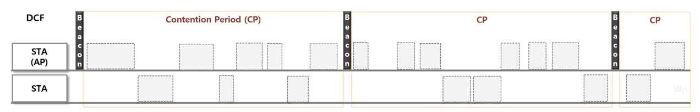

- 它是基于CSMA/CA模式去发包
- 每台STA都是由竞争周期去获取媒介传输资源，如图显示为CP
- 在传输之前都要去检查链路质量是否清楚，这里涉及到CCA后续在讲述
- 上述工作准备完毕后，对于每帧使用随机退避数
- 在DCF系统中，可能会采用RTS/CTS 模式，去减少封包碰撞

### 2.2 PCF (Point Coordination Function)

此模型有以下特征：

- contention-free services
- point coordination reside in access points（AP)， so infrastructure networks only
- 在免竞争阶段，AP会要求特殊的STA进行数据传输，此时的STA的标志位是携带CF-Poll标志位的
- 在要求传输完成后，会间隔SIFS周期，sta就会传输数据给到AP

它的整体示意图如下如所示：

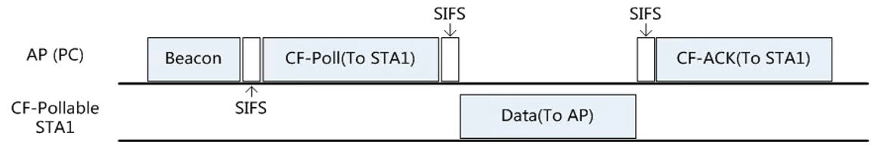

### 2.3 HCF (Hybrid Coordination Function)

此模式会在802.1e详解，简要说明一下，此种模式下，只要获得竞争窗口，会持续一段时间，在spec定义为txop，详情如下图所示：

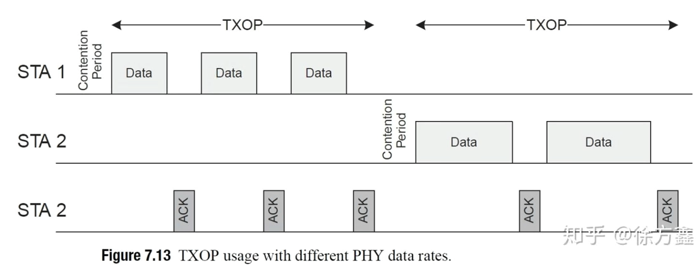

## 3 802.11 MAC-IFS(Inter Frame Spacing)

​		简单介绍了802.11的Mac层架构和常用Mac访问方法，在之前所提到的三个问题，特别是后面两个问题还没有得到解答，不过在解答此问题之前需要下说明一下，在帧发送的过程中，存在着帧间间隔需要介绍，帧间间隔是存在每个frame的发送阶段，因此有必要提前介绍后，在介绍后续的内容。

​		在Spec定义中，帧与帧之间的间隙称为IFS，STA应通过在指定的时间间隔内使用CSMD/CA函数，当前定义了十个不同的IFS，以提供访问无线介质，如下图所示：

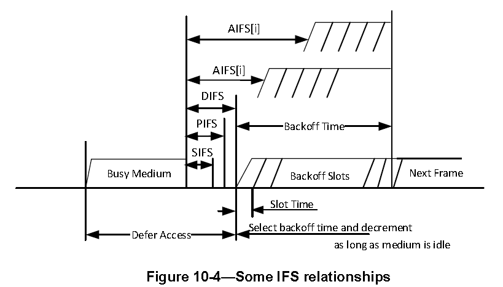

在802.11无线网络中，常用的帧间间隔SIFS, PIFS, DIFS, AIFS 

- SIFS(Short interframe space)
- PIFS(PCF interframe space)
- DIFS(DCF interframe space)
- AIFS(arbitration interframe space)  used by the Qos facility
- EIFS extended interface space

从图形的顺序可以知道， 时间大小如下 AIFS > DIFS > PIFS > SIFS

| IFS  | Used following list                                          | Value                                 |
| ---- | ------------------------------------------------------------ | ------------------------------------- |
| SIFS | in CTS, ACK, BA                                              |                                       |
| PIFS | Channel Switch announcement,  Before performing CCA     | SIFS + aSlotTime                      |
| DIFS | 用作数据帧传输和管理帧传输                                   | SIFS + 2*aSlotTime                    |
| EIFS | waiting time before the transmission if the received frame is corrupted | SIFS + DIFS + AckTxTime               |
| AIFS | used by Qos                                                  | AIFS[AC]= AIFSN[AC] *aSlotTime + SIFS |

### 3.1 Slot time

前面描述的ifs功能，使用IFS来表示等待一词描述frame之间，而在slot time内也理解为监听信道，在实际的过程中并不是如此，根据spec可以了解到 slotTime也不是整个周期都是在监听信道。参考一篇论文《WiFi-Nano: Reclaiming WiFi Efficiency Through 800 ns Slots》，其举例一个9us的slot time的组成如下：

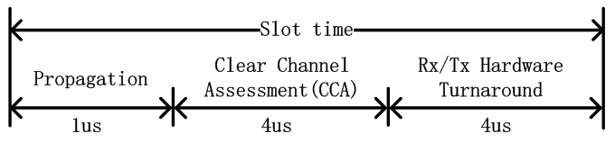

即Slot time由电磁波传播延迟propagation，信道检测CCA时间，以及天线的发送/接收切换组成，在spec中还添加了MAC的处理延迟，如下图所示。故这里就明确回答了，在一个slot time内不是整个周期都在监听信道，而只有CCA时间这一部分在监听信道。而最后一个天线发送转换也好理解一些，这里我们在说CCA监听信道的过程中，除了为了之前我们所述的backoff过程，实际上节点也在利用CCA来监听，是不是有给我的数据包。如果该数据包不是给我的，那么CCA监听结果就是忙，然后等一个slot以后继续监听。如果监听该数据包是给我的，那么就直接转换到接收状态，而不是继续进行每一个slot监听的动作了。

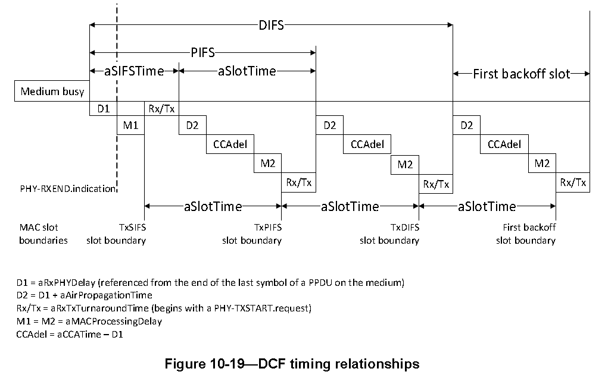

​		另外物理层的不同调制模式，slot time的时间也是不一样的，如下图所示, 采取OFDM的调制模式slot time的时间为9us，而在802.11g中 有long slot time（20us) 以及short slot time（9us）

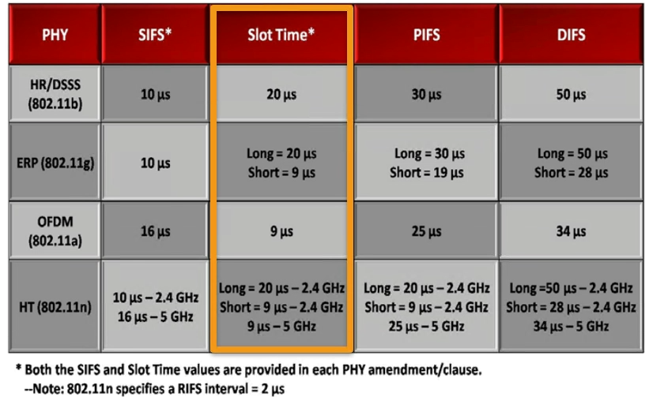

### 3.2 SIFS

​		在传输过程中SIFS有最高的优先权，主要针对ACK frame， cts frame，以及ba frame等，它执行的时间主要是包括phy层以及mac层的延迟 + trx的转换时间，如下图所示，与slot time一样每个协议配置的时间不同，Slot time的图定义所示。

​										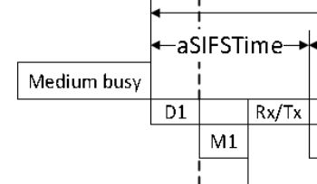

### 3.3 PIFS

​		PIFS是使用在PCF mac 模型里面，STA能够传输数据在contention free period期间。不同协议的PIFS时间，如上图所示。

### 3.4 DIFS

​		DIFS需要补充的一点，由于DIFS = SIFS + 2*Slot time。SIFS的功能我们可以理解成，包含天线发送接收转换，以及上层处理数据所需要的延迟时间。而DIFS中，由于正巧包含了两倍的Slot time，所以很大程度上，在DIFS内，应该执行了两次信道监听过程，但是这两次的监听过程没有触发backoff。只有监听到连续两次信道空闲后，那么DIFS之后才会进行backoff过程，该设计思想应该是源于P坚持-CSMA的，在802.11协议中，其他的部分帧间间隔也是基于slot time和SIFS计算所得，比如PIFS = SIFS + SLOT，EIFS = ACK time + SIFS + DIFS。

### 3.5 EIFS

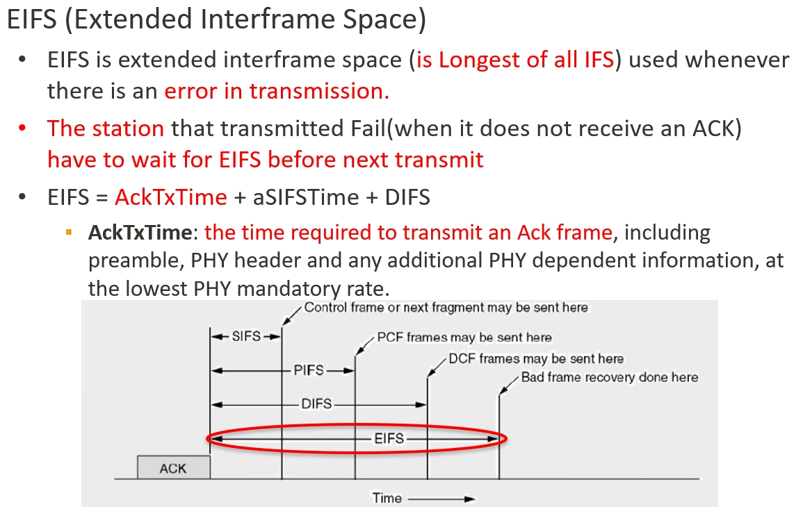

## 4 802.11 Mac  CSMA/CA 及 RTS/CTS

​		在DCF模式中，存在两种子模式：basic模式与 RTS/CTS模式，而basic 模式就是CSMA/CA模式，主要解决的问题就是隐藏节点问题以及后面会提到的暴露节点问题。

### 4.1 CSMA/CA

​		由于无线信道只有一个冲突域的特性，所以需要设置一种随机接入机制，以避免多个节点同时访问网络所带来的冲突问题，在WiFi协议中，该随机接入机制即是CSMA/CA。CSMA/CA的全称是Carrier Sense Multiple Access with Collision Avoidance，即载波侦听多路访问／冲突避免	

​		假定在如下拓扑网网络中，存在一个AP，与两个节点（STA1与STA2)，在无线网络中，如果STA1与STA2同时给AP发送数据，根据之前的说明，可能会在AP处发生冲突，从而两者都无法正确接收成功，最终传输失败。

而CSMA/CA提供一种规避机制，它的流程如下图所示，其中相应的帧间间隔已经说明，但还有几个概念需要说明。

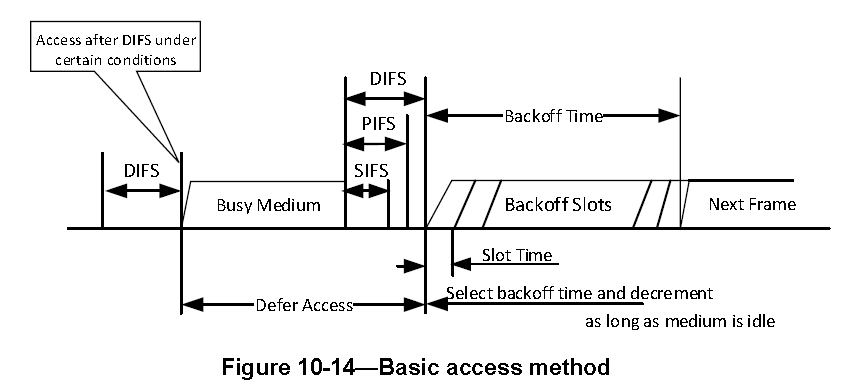

- contention window

  竞争窗口是用来让节点选择随机回退计数值（backoff counter）的范围。

- Backoff 

  随机回退过程是指每一个节点在竞争信道时，所经历的随机退避过程。在这一过程开始时，节点首先在竞争窗口中选择一个随机数为基准的随机回退计数值，同时每一个时隙，节点为 **"监听"** 信道是否空闲，若信道空闲，那么进行一次倒数，即计数值减1，若信道忙，则不进行相应倒数。当该随机回退计数值回退到0时，节点可以发送数据。

#### 4.1.1 物理载波监听和虚拟载波监听

​		如上图所示，经过DIFS等待后，会去判定媒介是否为busy或者idle，在802.11协议中定义了两种类型来感知媒介是否为busy的状态，即物理载波和虚拟载波监听。

**物理载波监听**

​		物理载波监听，也称CCA机制，主要有两种方法，能量检测（Energy Detection）和载波侦听（carrier sense）。

​		**载波侦听** ：载波侦听用做检测数据包的preamble，可以识别一个数据包的起始边界。简单的说，802.11中的preamble部分采用特定的序列所构造，该序列对于发送方和接收方都是已知的，监听的节点会不断采样信道信号，用其做相关运算，其计算值需要与一个阈值进行判断。**若大于，则认为检测到了一个信号，若小于则没有检测到。**节点在识别到数据包头部以后，对数据包进行接收并进行解调，并通过解调出数据包内部的Length字段来识别数据包的终止边界。

​		**能量检测**：能量检测采用硬件积分能量，其无法识别数据包的边界，但是能够识别数据体中的能量，已经来自其他异构网络的能量（比如蓝牙设备，微波炉之类）。是直接用物理层接收的能量来判断是否有信号进行接入，若信号强度大于ED_threshold，则认为信道是忙，若小于ED_threshold，则认为信道是闲。

​		能量检测的阈值要大于载波监听，按照协议规定要大于20dBm, 协议中规定，两种检测方式同时采用，且只要两者检测方式中，有一种判断信道是busy的话，那么就认为信道是busy的，只有两者都认为信道空闲时，那么再判断虚拟载波监听机制是否为0，以上条件都满足时，那么才可以进行backoff倒数。

​		在802.11中（以802.11a/g为例），**载波侦听阈值为-82 dBm，能量检测阈值为-62 dBm**。协议原文（参考2007第17.3.10.5 CCA sensitivity节.

**虚拟载波监听**

​		虚拟载波监听是有网络分配矢量（Network Allocation Vector， NAV)所提供。802.11帧通常会包含一个duration位，用来预定一段介质使用时间。**NAV本身就是一个计时器，用来指定预计要占用介质多少时间，以微妙为单位。**工作站会将NAV设定为预计使用介质时间，这包括完成整个处理必须要用到的所有帧。其他工作站会有NAV值倒数至零。只要NAV的值不为零，代表介质处于忙的状态，此即虚拟载波监听功能。当NAV为0时，虚拟载波监听功能会显示介质处于闲置状态。

​        利用NAV可保证工作站的基本操作不可被中断。如下图所示，RTS/CTS程序即属于一种基本操作。

source发送RTS控制帧信息，其中包含NAV时间长度，当RTS发出来过后，其他的设备的NAV duration就设置为source的 NAV值，该时间 包括了目的地回复的所有制的时间包括cts，data以及ack时间。然而网络中不是所有的设备都可以接收到source的RTS，因此接收端会以CTS帧加以应答，其中也包活NAV，不过计时相较于RTS的NAV值要小很多。此NAV可防止其他工作站在传输过程中访问介质，直到传输过程结束。一但完成整个过程，进入到竞争期间，如下图所示。

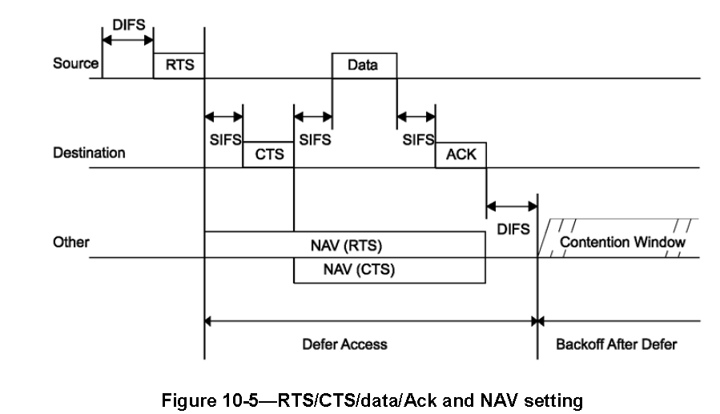

在使用CSMA/CA过程中，虚拟载波和物理载波实际过程中会同时使用，如下图所示：

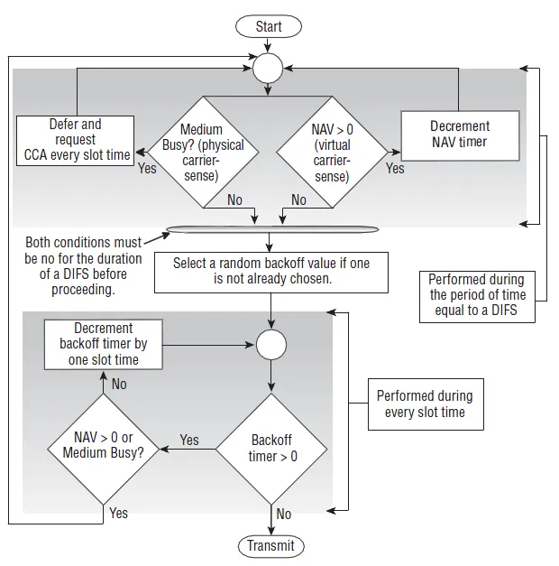

​		从该图中，我们可以明显看出，物理载波监听和虚拟载波监听是同时执行判断的，其中只要有一个是出于Busy状态，那么就不会触发随机回退计数值减1的过程，换言之，即是挂起了随机回退计数值。从该图中，我们可以明显得知，虚拟载波监听就是对应的NAV机制，而物理载波监听则是对应到了CCA（Clear Channel Assessment）机制。

​		协议中规定，两种检测方式同时采用，且只要两者检测方式中，有一种判断信道是busy的话，那么就认为信道是busy的，只有两者都认为信道空闲时，那么再判断虚拟载波监听机制是否为0，以上条件都满足时，那么才可以进行backoff倒数。

#### 4.1.2 CSMA/CA工作机制

在讲解CSMA/CA工作机制，利用下图来进行说明CSMA/CA的工作流程：

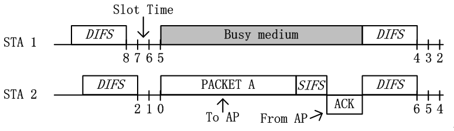

1. 当STA1与STA2都需要发送数据，需要进行信道竞争，首先需要“等待”DIFS时间，如果DIFS时间后，信道保持空闲状态，那么就可以进行backoff过程。如图STA2所示。
2. 若STA1与STA2进入backoff阶段，其首先需要从竞争窗口选择一个随机数，在802.11协议中，默认的初始竞争窗口为31，即随机回退计数值得范围即是[0,31]。在上图中，STA1则选择了8，而STA2选择2.
3. 在backoff过程中，每经过一个slot time，**节点会监听** 一次信道，若信道空闲，则相应的随机回退计数器的值减1。如上图中，经过3个slot time后，STA1的随机倒数计数器从8减至5，而STA2相应从2降至0.
4. 当节点的随机倒数计数器倒数至0时，节点竞争获得信道，从而可以发送数据。如上图，STA2获得信道后，发送PACKET A给AP。在AP接收到数据后，会采用CRC机制对数据进行校验，若校验通过，AP会在SIFS后，反馈ACK帧。
5. 当STA2成功发送数据，收到AP的ack帧后，此次数据传输完成。
6. 当这一次传输完成后，节点需要再次 "等待" DIFS的时间后，重新开始backoff过程。若节点刚刚发送完数据，那么在backoff过程开始时，需要重新从竞争窗口中选择一个随机数进行倒数。若节点没有发送数据，那么直接从上一次的倒数结果继续倒数。如上图中，STA 1没有竞争到信道，那么其在第二次的backoff过程中，直接基于上次的5直接进行倒数至4。这样的设计目的是为了保证网络传输的公平性。

​		在上述的过程中是封包在DCF 模型中正常的传递过程，而WiFi是一种不可靠传输，现实中的无线网络环境往往也是复杂多变的，封包在异常情况下会出现什么情况呢？在本文中讨论两种常见的情况

**Ack is not Received**

如下图所示：

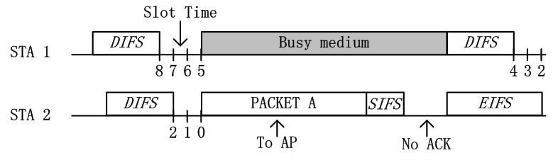

​		在正常情况下的第5步，AP没有成功接收节点的数据，或者AP对数据进行CRC校验错误，那么其不会反馈相应ACK给节点。节点在ACK timeout之后，则知道对方没有成功接收数据，该ACK timeout时间在理论分析时，一般与ACK接收时间相等，在具体工程设计中，可能会大一点点。那么发送错误的节点，**需要等待EIFS时间才可以再次接入信道，EIFS>DIFS，这样是为了避免一些较差的节点持续争抢信道资源。**比如图中STA 2即需要在等待EIFS之后，节点首先进行BEB（该机制我们后面详细讨论），然后重新开始backoff过程，而STA 1则直接在DIFS之后进行backoff。

**Collision happend**

如下图所示：

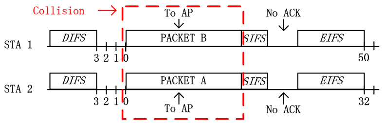

​		在 **"等待"** DIFS后，STA 1与STA 2从各自的竞争窗口CW中选择一个随机数，不过碰巧的是，两者随机到了一样的数值，如图中，STA 1与STA 2都是随机到了3作为随机回退计数值。在经过3个slot time之后，由于两者同时倒数至0，那么意味着两者会同时发送数据，如图中的红色虚线框表示，在AP处由于两者信号互相干扰，从而都无法正确解码，从而CRC校验错误，即发生冲突。在冲突之后，即若AP处CRC校验失败，则不会给任意节点反馈ACK数据包，故两节点在ACK timeout之后（即总共等待EIFS之后，图中EIFS因为DIFS，这里暂未做修改），准备进入下一次竞争。

​		如果上述情况出现，在经过EIFS时间后会再次选取随机数，而根据之前选取的随机数的窗口从而需要扩大随机选择数。按我们之前所述，在初始竞争时，节点的默认CW范围是[0,31]（假设初始窗口是802.11b机制下，即最大31，在802.11a这种，初始窗口就是15）。而如果在节点数较多的情况下，那么就有可能引发之前我们所述的冲突问题，从而我们需要扩大竞争窗口CW。具体在CSMA/CA中，我们则是采用二进制指数退避的方法对竞争窗口CW进行扩展，即发生一次冲突后，那么CW范围就会从[0,31]变化到[0,63]，如图中，在冲突之后，STA 1重新随机选择50，STA 2重新随机选择32。在802.11中，一共允许回退6次，第7次不倍增窗口，再次尝试重发，若再次失败，则丢包，是采取相应的指数增长。SPEC规定的增长如下：

### 4.2 RTS/CTS

​		RTS：Request To Send，即请求发送。RTS帧是一个单播帧，没有加密，其duration字段中填充包含后续发送过程中总体所需要时间。

​		CTS：Clear To Send，即信道清除帧。节点在收到CTS后，确认信道是空闲的，可以发送。CTS也是一个单播帧，没有加密，其duration字段包含除去RTS以及一个SIFS后，发送过程总体所需要时间。

​		RTS/CTS在解决之前提到的隐藏节点问题有非常好的帮助，同时也会解决暴露节点的问题。

#### 4.2.1 **隐藏节点问题**

如下图所示，一个AP和两个节点（STA1与STA2)。蓝色代表STA1的发送范围，绿色代表STA2的发送范围。

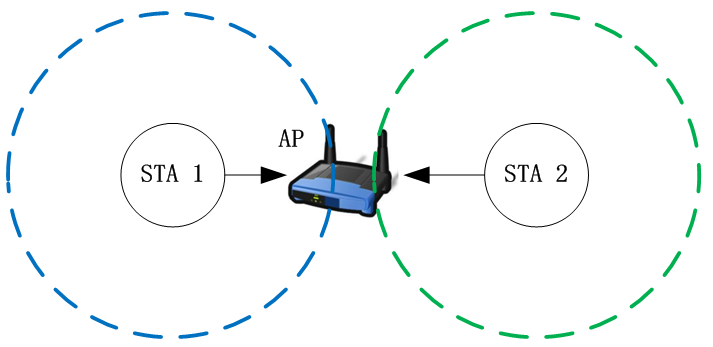

​		从图中，我们可以得知，由于两个节点的发送范围无法互相覆盖，从而两者在发送数据时，是无法通过物理监听的方法，探测对方是否有发送数据。从而按照我们之前所述的CSMA/CA机制，STA 1和STA 2一直会误认为信道空闲，从而不断倒数，当计时器到0时，则发送数据，如下图：

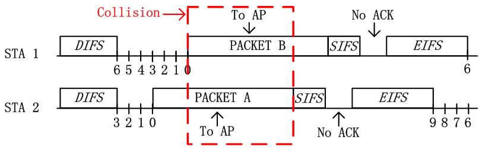

​		在上图中，由于STA 1与STA 2无法互相监听，即STA 2发送数据后，STA 1还继续进行backoff过程，从而继续倒数。当STA 1的随机回退计数值倒数至0时，STA 1也会发送数据。由于STA 1与STA 2的发送存在重叠区域，即也是发生了冲突，AP无法正确接收数据，即不会反馈ACK，最终这一轮传输失败。这一轮失败之后，STA 1与STA 2采用BEB算法重新选择随机数进行回退，但是由于两者没有办法互相监听，所以很容易再次出现同时传输的现象。所以在隐藏终端的情况下，网络性能最差时是无法传递数据包的，**换言之，STA 1与STA 2的吞吐量都趋近于0**。

为了解决这个问题，故在DCF中，引入了RTS/CTS机制。RTS/CTS具体的工作方法如下：

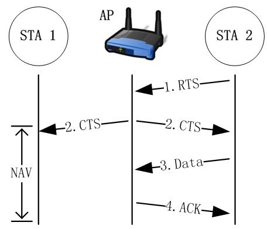

​		在上图中，STA 2已经倒数至0，其首先发送RTS数据帧给AP。若在AP处没有冲突，即AP成功解调出STA 2的RTS，AP会在等待SIFS之后发送CTS帧给STA 2。由于无线信道是一个广播信道，要是帧没有加密的话，那么所有节点都是可以解析其信息的，所以这里AP虽然是发送CTS给STA 2，不过STA 1也可以解析该CTS信息，这也是很多书上写，RTS/CTS都是一个广播过程的原因。

- 当STA 1接收到CTS之后，该CTS不是我所请求所获得的，或者说，该CTS不是对应发给我的CTS。从而STA 1会将CTS数据帧的duration给提出，并设置在自己本地的NAV（Network Allocation Vector）上。若NAV没有倒数到0，那么其会主动悬挂其随机回退计数值，在NAV没有倒数到0之前，其随机回退计数值不再继续倒数。
- 当STA 2接收到CTS后，其发现该其是之前发送RTS的反馈。故节点已知信道空闲，在等待SIFS后，STA 2发送数据。当数据传输完成之后，AP向STA 2反馈ACK，从而最终完成一次传输。

RTS/CTS工作机制对应的时序图如下：

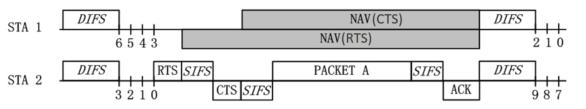

​		在上图中，我们可以发现，NAV的部分和我们在CSMA/CA的流程图中的Busy medium是一样的，其区别在于一者是物理载波监听（即之前的Busy medium是由于物理载波监听所引起的），而另者是虚拟载波监听（即NAV是由虚拟载波监听所引起的）。

​		在实际的路由器中，RTS/CTS模式不是以开关的形式存在，而是以RTS_threshold的形式存在的。RTS/CTS另外一个思维就是 **"采用小的数据包碰撞，来避免大的数据包碰撞"** ，从而如果数据包太小，那么则不需要采用RTS/CTS机制。设置RTS_threshold的范围一般为2347，其单位是byte，即如果数据包大小如果大于2347 byte，那么才会采用RTS/CTS模式，在现实应用中，可以根据具体的情况，设置一个最适合的值。

​		注：在本段中，我们所述RTS/CTS着重解决隐藏终端问题，同时RTS/CTS也是利用小数据包碰撞来避免大数据包碰撞的方法，该方法对于在没有隐藏终端**，但是节点数很多的网络中，也时很有效果的。**同时，本章节中，我们提到采用RTS/CTS模式来设置NAV，这里需要强调的是，RTS/CTS可以设置NAV，但是NAV不是仅仅只能用RTS/CTS来设置，只要数据帧MAC头部的duration字段有数值，那么就可以设置NAV，该机制在802.11协议中，有非常广泛的应用，比如PCF的Contention Free周期，EDCA中的TXOP机制等。

​		除了RTS/CTS模式是在协议层面解决隐藏终端问题，实际情况下还有很多解决隐藏终端的问题**，比如增加客户端功率，消除中间的障碍物**，将造成隐藏终端问题的节点或者AP移动个位置之类的，实在不行的话，那么控制下原始AP的功率，再添加入一个新的接入点也行，不过最后个方法需要小心一些，因为搞不好会引起下面所述的暴露终端问题。

#### 4.2.2 暴露终端问题

​		隐藏终端和暴露终端都是由于CSMA/CA中所采用的LBT机制所引起。隐藏终端是由于监听到的信道空闲而不是真的空闲，故引发冲突。而暴露终端是由于监听到的信道忙而不是真的忙，故其可以传输而不传输。

​		暴露终端问题可以简单定义为：节点之间能够互相监听对方。但其可以同时传输时，其不传输，从而造成浪费。**暴露终端在多个AP（或者多个Receiver）时才有可能发生。**（Note，**此场景在WiFi6 有提出SR，以及WiFi7提出cosr**来进行解决，后续会详细讲解解决此问题的方法）

​													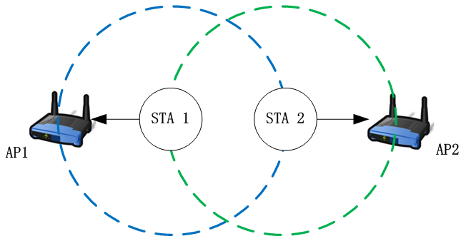

​		在该拓扑中，STA 1与STA 2为两个节点，其中STA 1关联在AP1上，STA 2关联在AP2上。图中蓝色虚线代表STA 1的发送范围，绿色虚线代表STA 2的发送范围。

​		图中AP1处于STA 1的覆盖范围内，而不再STA 2的覆盖范围内。AP2处于STA 2的覆盖范围，而不在STA 1的覆盖范围内。换言之，AP1只能接受到STA 1的数据，AP2也只能接收到STA 2的数据。当STA 1与STA 2同时发送时，接受节点AP1或者AP2处均不会发生冲突，故其是可以同时传输的。但是由于这样的拓扑特殊性以及DCF中CSMA/CA的工作机制，造成STA 1与STA 2无法同时传输，该问题则是暴露终端问题。

​		在CSMA/CA中，接入是遵守LBT（Listen Before Talk）机制的。我们在DCF的介绍中所述，每一个节点在接入信道之前需要进行backoff。在该过程内，若信道空闲，则每经过1个slot，随机倒数计数器进行一次倒数。若信道非空闲，则节点不会对随机倒数计数器进行倒数，并对其进行悬挂。只有当其倒数至0时，才可以发起传输。其中信道空闲与否是通过载波监听机制进行判断的，而在DCF中，存在物理载波监听和虚拟载波监听两种模式，这两种监听方式都有可能引起暴露终端问题，以下我们分两种情况进行讨论。

**物理载波监听引起的暴露终端**

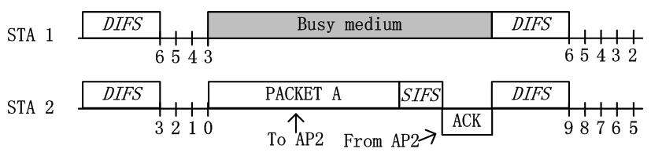

​		如上图所示，由于STA 1与STA 2可以互相监听。由于STA 2选择了较小的随机数进行倒数，从而其最先倒数至0，并进行发送。当STA 2首先发送数据包给STA 2后，STA 1监听信道为忙状态，从而无法发送信息。故根据拓扑而言，STA 1是可以传数据给AP1的，但是由于监听STA 2正在传输，导致信道忙，故STA1悬挂随机倒数计数器，无法继续倒数，从而无法传输。

​		这里实际上我们还可以更深入了解一下，实际上STA1为什么需要在别人传输的时候，悬挂自己的随机倒数计数器。在CSMA/CD中，实际上是没有悬挂过程的，只有在CSMA/CA中才存在。在CSMA/CD中，若信道忙，节点就不停的去监听信道，一旦发现空闲就传输。而在CSMA/CA中，节点在中间实际上不是监听信道，而是接收数据。其主要原因在于，STA 1在检测到STA 2正在传输造成信道忙时，其立刻开始接收该STA 2的数据，因为STA 1不知道该数据是否是发给自己的。只有当完整接收数据，CRC校验通过后，STA 1才可以检查帧MAC头部所对应的目的BSSID地址，看是否是自己的数据包，若不是才可以丢包。换言之，CSMA/CA中，悬挂实际上是为了接收，从而导致的现象是悬挂而已。

**虚拟载波监听引起的暴露终端**

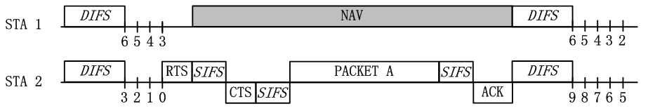

​		如上图所示，在暴露终端场景中，若STA 2不仅选择了较小的随机数进行优先倒数，并且其发送的数据包是RTS数据包。当STA 1识别到该RTS数据包后，其就会被设置为NAV状态，无法在后面的过程主动竞争信道，进而无法传输。与之前描述用RTS/CTS解决隐藏终端问题时不同，在解决隐藏终端问题中，NAV是由AP所反馈的CTS帧所进行保护。而这里由于STA 1与STA 2能够互相监听，换言之，在暴露终端情况下，STA 1的NAV是被STA 2所发送的RTS帧进行保护的。在STA 1被NAV保护后，其也无法传输，最终导致暴露终端问题。

因此在这里简单总结一下RTS/CTS的作用：

- 保证数据的稳健性，**"采用小的数据包碰撞，来避免大的数据包碰撞"** 。

- 解决隐藏节点问题，暴露终端问题在WiFi6协议上有说明。

- 动态带宽分配。

- 对于11g（ERP）STA，需要保护不知道什么是OFDM的11（非ERP）,考虑到向后兼容性，11g STA可以检测到11b，而相反则不成立。在11g STA之间交换RTS/CTS，11Mbps的11b速率将使11b STA知道信道是否被占用。在Beacon框架中，有ERP元素，它指示BSS中是否有任何11b（非EPR）STA，这将帮助11g STA了解

  BSS中存在11b STA。

## 5 802.11 MAC EDCA

## reference

1. https://zhuanlan.zhihu.com/p/51412066
2. https://zhuanlan.zhihu.com/p/20721272
3. http://home.ustc.edu.cn/~zzx2002/new/2021/08/04/mathjax/
4. https://zhuanlan.zhihu.com/p/20731045
5. 802.11无线网络指南
6. 802.11-2022 WiFi spec

