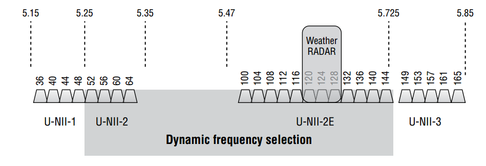
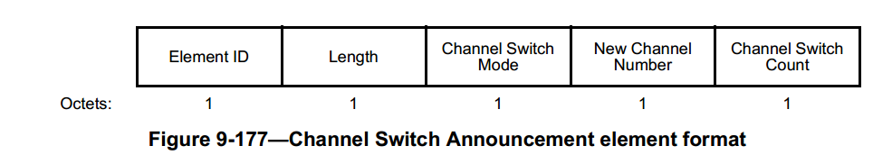
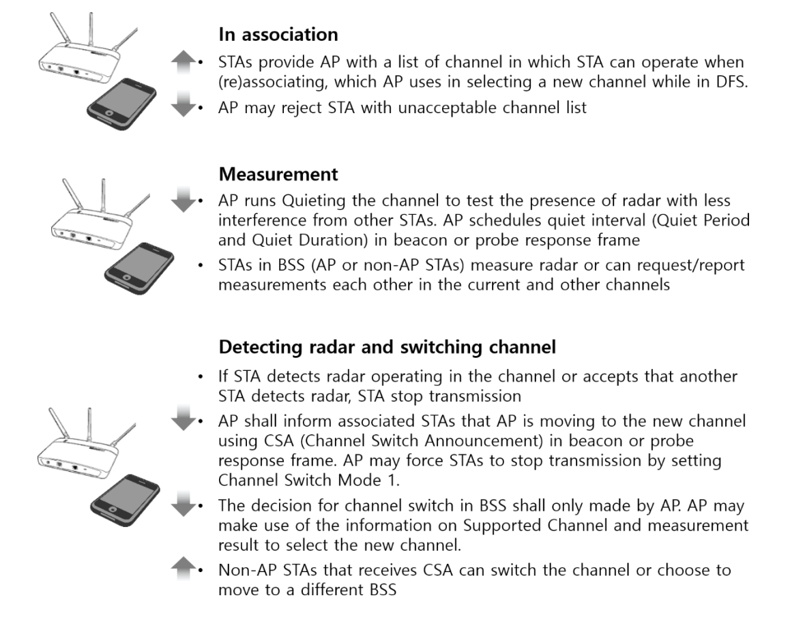

# Introduction DFS

​		DFS（Dynamic Frequency Selection）动态频率选择。802.11a标准使用5GHz频率。这个标准在美国没有问题，但是在欧洲却遇到强烈的抵制。
​		因为欧洲军方的雷达系统广泛运用这一频率(其中探测隐型飞机的雷达就使用这一频率)。如果民用的无线产品也使用这一频率，很可能会对军事雷达和通讯产生干扰。为了解决这一安全顾虑，在欧洲出售的WLAN产品必须具备TPC和DFS这两个功能，即发射功率控制和动态频率选择。

- **TPC是为了防止无线产品发放过大的功率来干扰军方雷达**。
- **DFS是为了使无线产品主动探测军方使用的频率，并主动选择另一个频率，以避开军方频率**。

​		根据WiFi信道规划DFS channel规定如下，在u-nii-2（5.25-5.35GHz）以及U-NII-2e 带宽（5.47-5.725Ghz）划分为DFS 信道。如下图所示：

## DFS工作机制

​		AP第一次在DFS channel上传输数据，必须要执行CAC（channel availability check），如下图所示，此过程需要执行60s，可以理解为需要是使用的DFS channel上静默60s，如果在此期间有检查到雷达脉冲，则AP不能够使用此信道，需要重新选择信道，如果没有检查到，则AP可以在此信道传输beacon 等管理帧。在欧盟的标砖中，针对TDWR(terminal Doppler weather raddr)使用的120,124,128信道，监听监测时间长达10mins。

​		STA也是需要遵循雷达监测的原则，因此他们是不能够刚使用的过程中向DFS channel 发送 probe request，在触发scan后，如果他们在DFS channel扫描到有AP在此DFS信道上发送beacon，STA则认为此信道的雷达检测试赶紧的，然后才可以做初始化连接，进行auth以及assoc交换。

​		需要注意的是雷达检测试持续不断的一个过程，如果AP和STA已经工作在DFS channel上，但是此时检测到有雷达脉冲，AP以及与它关联STA都不能够在此信道工作，如下图所示。

​		此时AP将发出channel switch announcement（CSA）信息通知STA将移至其他的channel上。CSA 信息在以下几种管理帧中出现，**action frame，beacon frames，probe response frames**,  在Spec中有规定，此时AP和STA需要在10s内离开此信道，因此AP 需要发送多个CSA frames，从而保证所有的设备都离开。CSA帧格式定义如下：

其中new channel一般都是non-DFS Channel. 但一些供应商为STA提供了指定DFS channel。

​		AP和客户端一旦切换到非DFS通道，至少30分钟内不能返回到之前的DFS通道。这就是所谓的非占用时间。返回原始DFS信道的一个挑战是，在30分钟的等待期之后，AP将再次在DFS信道上监视60秒，然后再发送一次。这意味着当AP不再为客户端提供服务时，至少会有60秒的间隔。目前Broadcom，提供了一个称为zero-wait  DFS的解决方案来解决这个问题，使用5 GHz接入点无线电的MIMO。例如，一个4×4:4 AP可以在DFS频道104上用一根天线MIMO无线电链监听，同时仍然在监听用剩下的三个无线电链向非dfs频道36的客户端提供访问。如果通道104被清除，AP可以向通道36上的所有客户端发送一个新的通道切换通知，告诉他们返回到原来的通道104。更好的是，AP可以利用单个MIMO无线电链来收听不同的DFS信道(例如，信道64)。如果新的DFS通道在60秒内是空的，客户机也可以移动。这样做的好处是，客户机可以转到通道64，而不必等待30分钟才能返回通道104。

​		因此整体流程，可以总结如下：

## DFS实际应用

​	在当前的AP 厂商中，一般是不会默认开启DFS功能的。原因如下：

1. 是否使用DFS功能，决定权在用户或者odm厂商定制。
2. 由于开启DFS后，需要进行FCC认证，此认证在如果是出口美国市场，认证时间长达几个月，因此在实际的使用过程中，一般都是拿到认证后，进行固件升级。
3. 在实际的使用过程中，通常周围的环境可能产生假脉冲雷达信号，让他们发出信号。

## 参考文献

1. CWNA  chapter 13
2. https://blog.csdn.net/weixin_42353331/article/details/88686831
3. 802.11 spec 11.8

