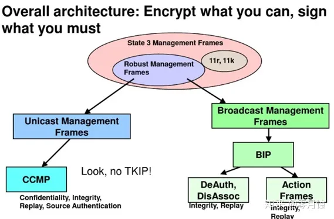
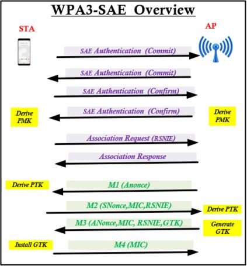
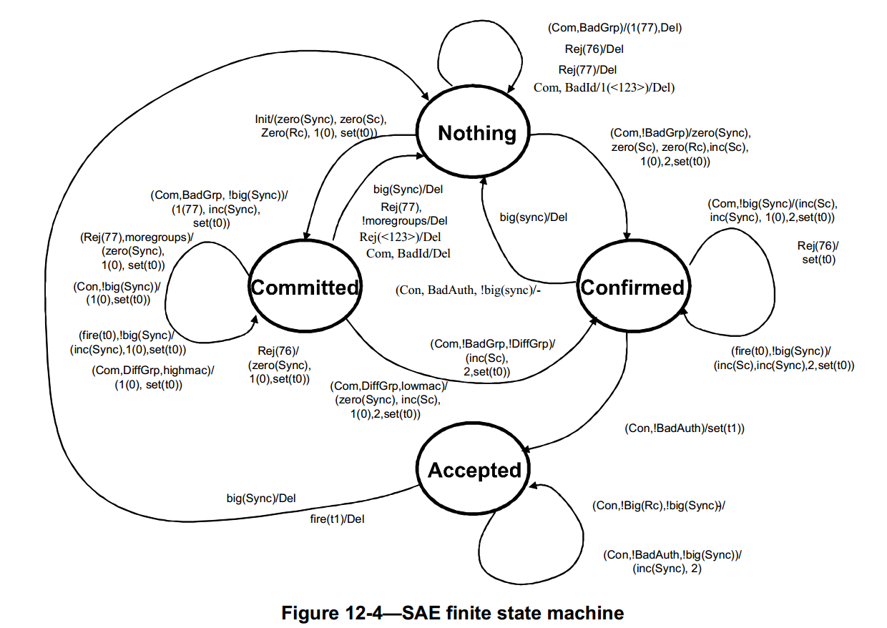

[toc]

# Introduction Wi-Fi security

## 1. WLAN Security Overview

​		根据目前802.11-2020 spec针对802.11网络采用两种类型的加密算法。

-  RSNA algorithms
- Pre-RSNA algorithms

​		在当前的spec中并没有规定是否可以同时运行上述两种算法，其中Spec有明确规定WEP算法是被废弃的，详情见802.11-2020 12.2.1章节，另外TKIP算法也是不被联盟推荐的。

### 1.1 802.11 Security Basics

​		当对802.11 网络进行加密的过程中，有5个元素是必要的

1.  Data privacy
2. Authentication，authorization and accounting（AAA)
3. Segmentation
4. Monitoring
5. Policy

​		首先在无线网络中，数据的传输都是在空气中，因此为了保证数据的安全性，需要对数据进行相应的加密。其次在802.3以太网中也需要对端口进行认证，802.11也借用此机制，保证使用者加入802.11无线网络都是通过认证的，由于无线网络的不可靠性，因此在进行认证后还需要更多的认证机制来保证加入者的安全性。经历上述步骤后，802.11无线网络机制可能还是被攻击，因此还需要提供监控机制随时保证网络的安全。当然上述所有的加密步骤都要在合适的加密策略执行，从而保证整个网络的安全。

### 1.2 802.11 Security History

​		802.11 Security历史表如下：

| 802.11 Standard | Wi-Fi Alicance Certification       | Authentication                 | Encryption Method                   | Cipher                            | Key Generation |
| --------------- | ---------------------------------- | ------------------------------ | ----------------------------------- | --------------------------------- | -------------- |
| 802.11 legacy   |                                    | Open system or Shared Key      | WEP                                 | RC4                               | Static         |
|                 | WPA-Personal                       | WPA PSK and WPA Pre-Shared Key | TKIP                                | RC2                               | Dynamic        |
|                 | WPA-Enterprise                     | 802.1X/EAP                     | TKIP                                | RC4                               | Dynamic        |
| 802.11-2007     | WPA2-Personal                      | WPA2 Pass-phrase               | CCMP(mandatory)                     | AES(mandatory)                    | Dynamic        |
| 802.11-2007     | WPA2-Enterprise                    | 802.1X/EAP                     | CCMP(mandatory)<br />TKIP(optional) | AES(mandatory)<br />RC4(Optional) | Dynamic        |
| 802.11-2018     | WPA3-Personal<br />WPA3-Enterprise | SAE/802.1x/EAP                 | GCMP-256                            | AES                               | Dynamic        |


## 2. Legacy 802.11 Security

​		802.11无线加密技术从1997年发布至今，已经有很多重大的改变，根据802.11-2020 spec规定，传统加密技术或者pre-RSNA(Open System authorization，Shared Key authorization and WEP encryption) 依然有被定义到，即使Spec中也明确提出要避免使用Lengacy 802.11 Security，它们仍然被集成到大多数(如果不是所)802.11设备中，以提供与现有设备的向后兼容性。理解这些安全方法、理解为什么开放系统身份验证仍然有效以及为什么应该避免共享密钥身份验证和WEP加密是很重要的。

### 2.1 Authentication

​		802.3的设备需要与其他设备进行连接交互，只需要两者通过网线插口连接好即可，而802.11无线网络的设备端与接入端的认证，只是他们连接的第一步。在802.11-2007中有提到两种认证方式：Open Sytem authentication 和Shared Key authentication。

#### 2.1.1 Open System Authentication

​	open system authentication是在当前spec中802.11-2020中没有被废弃的加密机制。它也被称为Null authenticated algorithm ，因为它的交互方式简单，在常见的使用场景中也不需要加密方式去验证对比以排查问题，开发系统认证它的工作流程如下图所示：


​		如上述图所示 open system authentication client与AP之间只有4帧的交互，其中STA可以通过passive 或者active scan 发现AP。通过sniffer来抓取他们的具体交互信息


在上述1246行帧中


*(wlan.fc.type == 0)&&(wlan.fc.type_subtype == 0x0b)* 通过wireshark 可以看到 authentication Algorithm是open system，序列号是1代表auth request，然后AP回复authentication response，Authenticaion SEQ变为2


然后Cline发起assoc request后，AP回复assoction response并返回连线结果，如下图所示：


#### 2.1.2 Shared Key Authentication

​		Shared Key authentication是采用WEP的方式去加密设备，在连线的过程中要保证Client和AP端的静态密码是一致的，如果两端静态密码不匹配，则两台设备交互则会失败，client与AP之间采用shared key的方式交互，处理过程与open system类似，但有一点不同的是shared key会在auth的过程中去检查其中的key是否匹配。下面是它的工作流程图：


​		下面是Shared Key的抓包示例：

他们整体交互过程如下，整体交互过程中有4个auth frame


第一个是发出authentication request给AP，SEQ No 是1，authentication algorithm是shared key，如下图所示：


然后AP发送一个明文挑战给Client，次数SEQ NO是2，如下图所示：


由于后面两次auth数据采用WEP的加密方式去处理，因此需要wireshark去进行解密，sniffer结果如下：


client明文挑战后以authentication request的方式在发送给AP，SEQ NO是3解密后sniffer结果如下：


AP收到Client的WEP加密数据后，进行解密后进行比较是否匹配AP的明文挑战，匹配后发送第四包auth frame给STA，并返回验证结果，sniffer结果如下：


### 2.2 Wire Equivalent Privacy(WEP) Encryption

​		WEP主要是针对ISO mode L2的加密方法，在当前的Spec 802.11-2020有两种称呼，WEP-40以及WEP-104，主要是由于他们的static key的长度不同，如下图所示：


由于MSDU包含Layers3~7的数据以及LLC相关的数据，在目前针对L2的加密算法都是针对MSDU 进行的，下图WEP具体的帧格式的大小设定，从图中看出WEP将对MSDU和ICV部分进行加密，对IV信息是不加密的，其中IV信息中包含ID详细信息，接收设备可以在其中设别哪个密钥已用于加密。


WEP加密过程步骤如下：

1. 24bit的明文IV(Iniialization Vector)随机生成并与静态密钥结合
2. 密钥长度在64位WEP中位40位，在128位WEP中密钥长度为104位
3. IV & Key用ARC4伪随机算法生成密钥流
4. 在明文数据上加上CRC并作为32位ICV(Integrity Check Value) 附加到明文的数据的末尾
5. 然后使用XOR过程，将生成的密钥流和明文数据位组合
6. 最终生成结果是WEP密文

WEP添加8字节（4-IV、4-ICV）加密开销，导致最大MSDU从2304字节增加到2312字节。加密过程整体如下图所示：


WEP加密步骤如下：

1. 收到对端发过来的加密明文，将其中IV信息与本地的WEP key 静态结合
2. IV & Key通过ARC4 伪随机算法生成密钥流
3. 生成的密钥流与加密的明文 使用XOR 解析
4. 一方面解析出明文，另外一方面检查ICV是否与预期相等。

整个过程如下图所示：


随机WEP的使用，在实际的使用过程中，WEP相关的缺点也暴露出来，因此802.11Spec中已经明确废弃此加密算法，为了解决以下的问题，进而提出TKIP加密算法。

1. IV冲突攻击 --- 24位IV可能发生IV冲突，攻击这可以轻松恢复WEP密钥
2. 弱密钥攻击
3. 再注入攻击 --- 存在实施数据包注入工具，以加速再流量较小的网络上收集弱IV
4. 位翻转攻击 --- ICV数据完整性检查安全性较差，它不是真正完整校验，真正需要hash

## 3. Encryption Ciphers and Methods

### 3.1 Encryption Basics

​		加密算法的本质，首先是为了对数据进行保密并防止篡改，其次更具有身份验证的功能，根据密钥类型的不同，加密算法分为对称和非对称两种

**对称算法**：采用单钥密码系统的加密方法，同一个密钥用来加密和解密，常见的对称加密算法有 DES，3DES，AES，RC2，RC4，RC5等。由于此方法算法公开，计算量小，加密效率高，在无线网络中广泛使用。效果如下图所示：


**非对称算法**：非对称算法使用一对密钥，一个用于加密，另一个用于解密。解密密钥是保密的，称为私钥，加密密钥是共享的，称为公钥。可以表现如下图所示：


常见加密算法的对比如下：

| 名称 | 密钥长度      | 运算速度    | 安全性               | 资源消耗 | 应用场合                 |
| ---- | ------------- | ----------- | -------------------- | -------- | ------------------------ |
| DES  | 56位          | 一般        | 低                   | 中       | 适用与硬件实现           |
| RC4  | 256位         | 比DES快10倍 | 中                   | 低       | 算法简单，易于编程实现   |
| AES  | 128、192、256 | 快          | 目前最安全的加密算法 | 低       | 适用与无线网络的安全保障 |

AES:

AES算法是Advanced Encryption Standard 的缩写，是美国联邦政府采用的一种区块加密标准。这个标准用来替代原先的DES，已经被多方分析且广为全世界所使用。它的工作流程如下图所示：


### 3.2 WLAN Encryption Methods

​		802.11-2007标准定义了三种工作在OSI模型L2的加密方法:WEP、TKIP和CCMP，后来在新增的协议中802.11-2020新增了BIG以及GCMP算法，这些第2层加密方法所保护的信息是在第3 -7层中找到的数据。第二层加密方法用于为802.11数据帧提供数据隐私。

​		802.11数据帧的技术名称是MAC协议数据单元(MPDU)。如图所示，


802.11数据帧包含一个二层MAC报头、一个帧体和一个拖尾，这是一个32位的CRC，称为帧检查序列(frame check sequence, FCS)。第二层报头包含MAC地址和持续时间值。封装在802.11数据帧的帧体内部的是称为MAC服务的上层有效负载数据单元(MSDU)。MSDU包含LLC (Logical Link Control)和layer 3 -7的数据。MSDU的一个简单定义是，它是包含IP包和一些LLC数据的数据有效负载。

​		802.11-2007标准规定，MSDU有效负载可以是0到2304字节的任何地方。由于加密开销，帧体实际上可能更大。采用WEP、TKIP、CCMP等专有的二层加密方法对802.11数据帧的MSDU有效载荷进行加密。因此，信息即是被保护的是上面的3 -7层，也就是通常所说的IP数据包。

#### 3.2.1 TKIP （Temporal Key Integrity Protocol)

​		TKIP（临时密钥完整性协议）是第一种广为使用的L2加密方法，它是为解决WEP相关的弱点提出来的，2003年WPA(Wi-Fi Protected Access), TKIP是必选的，但随着加密算法的更新，在802.11-2007之后，TKIP变为可选项。

​		TKIP解决WEP的以下问题

- 临时密钥---增强抵御网络攻击能力
- 排序 --- 击败重放和注入攻击
- 密钥混合 --- 改善已知的IV冲突和弱密钥攻击
- 增强数据的完整性（MIC) --- 改善位翻转和伪造攻击风险
- TKIP --- 解决 TKIP MIC的限制

TKIP加密流程图如下所示：


​		根据Spec可以知道，在加密阶段会生成48位TKIP序列计数器（TSC)并分成6个8字节（TSC0-TSC5)，第一阶段密钥将128位临时密钥（TK）与TSC2~5以及传输地址（TA）混合后输出TTAK(TKIP-mixed transmit address & key), 在第二阶段将把TTAK，TSC0~1以及TK进行混合后，输出WEP Seed，它包含初始化向量IV和104位WEP密钥，输出的WEP Seed将采用ARC4加密算法生成密钥流。生成的密钥流最后和明文数据,MIC以及ICV通过XOR组合生成对应的加密数据。

​		MIC Key：它是从TK中取出来的指定位，spec中规定

A STA shall use bits 128–191 of the temporal key **as theMichael key** for MSDUs from the Authenticator’s STA to the Supplicant’s STA.
A STA shall use bits 192–255 of the temporal key **as the Michael key** for MSDUs from the Supplicant’s STA to the Authenticator’s STA.

​	从加密流程来看，TKIP相对于WEP主要是多了左半部分，右半部分的内容其实大同小异，从MPDU的内容来看，主要多了extender IV和MIC两个部分。下面是基本过程：

1. TKIP使用消息完整性代码 MIC，MIC使用DA、SA、MSDU优先级和明文数据计算得出，它的字节大小为8字节，标记为M0-M7.TKIP采用的MIC仅包含20位的有效安全强度，很容易受到brute-force攻击，所以802.11标准定义TKIP countermeasures，步骤如下图所示：

   1. MIC故障将被记录

   2. 如果在60s内发生两次MIC故障，STA或AP必须禁用所有TKIP帧的接收60s

   3. Key refresh-PTK & GTK 需要改变

      

      

2. MIC追加到MSDU尾部后，将他们看成一个新的"MSDU"，如果有开启分布功能，而且符合分片要求，就会对"MSDU"进行分片，比如分成两片，那么plaintext MSDU和MIC就可能分别组装在两个MPDUS中进行发送，接收端会将这些MPDUS进行重组，生成原来的"MSDU"，因此帧的分片对MSDU的加密影响不大。

   Note：如果MSDU过大，需要多个MPDU中进行发送，使用TKIP加密时，会使用相同的extender IV，但每一个MPDU会分别使用一个单调递增的TSC。

3. MSDU经过封装，生成没有加密的 plaintext MPDU，同WEP一样经过计算生成 ICV，并将它追加到 plaintext MPDU的尾部。

4. TKIP通过phase1和phase2两个key mixing阶段生成WEP seed。

5. TKIP将上面得到的WEP IV和ARC4 key作为WEP seed通过ARC4算法生成keystream（请对照WEP加密）

6. 最后将keystream，plainte MPDU，ICV，IV（TSC０，TSC１ Key ID），extended IV， MIC进行异或计算生成最后用于发送的Encrypted MPDU

经过TKIP加密以后生成的加密MPDU格式如下：


从图中可以看到，该帧主要由802.11 MAC Header（前32个字节）、Frame Body 和CRC三个部分构成，Frame Body部分主要由以下5部分组成：

（a）IV/Key ID
（b）Extended IV
（c）MSDU payload
（d）MIC
（e）ICV

1. 第一部分是802.11 MAC Header（前32个字节），可以看出头部并没有作任何改动

2. IV/Key ID : 它的长度是4个字节，和WEP加密中的IV长度一样，但是其中的内容并不一样，它的前三个字节分别是TSC1，WEP Seed和 TSC0 (TSCn后面分析)；最后一个字节分别由Reserved（5bit），EXT IV 1bit，Key ID 2bit； EXT IV是用来指定是否传送后面的Extended IV，对于WEP来说不需要这部分，所以设为0，对于TKIP加密来说，Extended IV是必须的，所必须设为1；Key ID需要根据帧封装的加密算法来设，它一般都是由MLMESETKEYS.request 原语完成，它是key index缩写，是从WEP继承而来的，在WEP中可以用于指定使用第几个key，但是在TKIP中一般设为0，在没有key mapping key时候，不能够使用<RA,TA> pair 来鉴别要用哪个key，这时会用到这个默认的key 0。、

   TSC5是最高有效位，而TSC0是最低有效位，因为TSC0-TSC5是从6个字节长的TSC派生而来的（MSB是Most Significant Bit的缩写，最高有效位。在二进制数中，MSB是最高加权位。与十进制数字中最左边的一位类似。通常，MSB位于二进制数的最左侧，LSB位于二进制数的最右侧）。

3. Extended IV： 它的长度4个字节，它是从48-bit TKIP sequence counter (TSC2 through TSC5)派生而来的；从图中可以看出IV/Key ID和Extended IV字段都是没有加密的，我们也可将这两个字段一共8个字节看成TKIP的头部

4. 接下来是加密的payload MSDU

5. MSDU后面是MIC，8个字节，当它追加到MSDU后面时，就成了MSDU的一部分，用于后面的MPDU分片

6. Frame Body的最后是Integrity Check Value （ICV），4个字节，它是通过计算整个MPDU而来的。MSDU upper-layer payload和 MIC及ICV一样，都有进行加密

7. 帧的最后一部分是CRC，它是4个字节的FCS，它是通过计算全部的帧头和帧体部分得来的（calculated over all the fields of the header and frame body ）

由于额外的IV（4字节），Extended IV（4字节），MIC（8字节）和ICV（4字节），一共20个字节。也就是说TKIP加密额外的给数据帧体添加了20个字节，那么TKIP加密的数据帧中MSDU‘　的最大值将会达到2324字节（802.11规定一个帧中MSDU的最大size是2304字节）。

抓包查看iv向量是符合TSC递增的规律的。


#### 3.2.2 CCMP

​		CCMP（Counter Mode with Cipher Block Chaining Message Authentication Code Protocol)是具有密码块链接消息身份验证代码协议的计数器模式，它是使用的AES加密算法，而AES是基于Rijindael算法的分组密码，此算法允许选择块大小和密钥大小（每个128,192和256位），IEEE 802.11-2007规定将密钥大小和块长度限制为128位。CCMP加密在802.1i修正案中定义，用于取代TKIP和WEP加密。在CCMP加密使用的AES算法中都是使用的128bit的密钥和128bit的加密块,关于CCM的定义请参考《IETF RFC 3610 》。

 CCM主要有两个参数：

​		M=8,表示MIC是8个字节；L=2，表示长度域是两个字节一共16位，这样就可以满足MPDU最大的长度。同时CCM需要给每个session指定不同的temporal key，而且每一个被加密的MPDU都需要一个指定的临时值，所以CCMP使用了一个48bit的PN（packet number），对同一个PN的使用将会使安全保证失效。

CTR（CounterMode ）：用于提供数据保密性

CBC（Cipher-Block Chaining ）

CBC-MAC（Cipher-Block Chaining Message Authentication Code ）：用于认证和完整性

下图为CCMP的加密过程：


- MAC header

  802.11 MAC头部

- Plaintext data

  需要发送的playload

- PN(packet number)

   长度为128bit，它和TKIP中TSC（TKIP Sequence number)相似，它是每个帧的标识，而且会随着帧的发送过程不断递增，可以防止回放和注入攻击

- TK（temporal key）

  和TKIP中的一样，CCMP也有一个128bit的TK，可能是PTK或者GTK，两者分别用于单播数据和组播数据加密。

- Key ID

  用于指定加密用的key,注意这个ID是index的缩写，一般设为0

- Nonce

  是一个随机数，而且只生成一次，它一共长104bit，是由PN(packet number，48bit), Qos中的优先级字段（8bit）和TK(transmitter address , 48bit)这三个字段组合来的，需要注意，不要和4路握手的Nonce混淆。

  Nonce由13个自己构成，它的组成如下，

  

  其中Nonce Flags一共8位，主要内容如下：

  

  - Priority subfield ：如果没有支持Qos Control，那么这个位置0；如果由支持Qos Control，那么这个需要根据QC TID设成0-3
  - Management field ：如果是管理帧，这个位置1
  - Reserved：保留位清0

  

- AAD (Additional authentication data)

  由MPDU的头部构建而来的，它用于确保MAC头部的数据完整性，接收端会使用这个字段来检验MAC头部。如下图所示：

  

  其中深灰色的部分会被用来构建ADD，而且会被CCM保密，其中一些浅灰色的也会用于构建AAD，根据帧的类型不同，其中一些字段可能没有使用，那么就会用0覆盖。这样计算出来的MIC，不仅确保了MAC Header的完整性，也确保了frame body的完整性，而且所有的MAC address（包括BSSID）都有受到保护，同时MAC Header的其他一些域也有受到保护。接收端也会对这些受保护的MAC Header进行完整性校验，比如frame type and the distribution bits两个位是受保护的，那么接收端就会对这两个受保护的位进行校验，需要注意的是，AAD并不包括MAC头部的Duration 字段，因为在正常的IEEE 802.11 操作中，Duration 字段是会随时变动的。**MAC头部的一些会动态改变的子域就不会纳入AAD的构建而以0进行覆盖**

  

  通常在Frame Control域中的一些子域，Sequence Control域和Qos Control 域会覆盖为0，比如QC或者AE,因此这些域不会受到保护，比如Retry bit and Power Management bits不会受到保护。

  下面是Spec中详细介绍AAD所使用的主要字段：

  

下面是加密流程：

1. 每一个新的MPDU需要发送时，都会重新创建一个48bit的PN，如果是重传的MPDU，则使用原来发送MPDU的PN
2. 利用MPDU头部构建AAD.
3. 每一个新的MPDU需要发送时，都会重新创建一个48bit的PN，如果是重传的MPDU，则使用原来发送MPDU的PN.
4. 构建8个字节的8-octet CCMP 头部，这个头部由Key ID 和PN构成，PN有被分成6个字段。你会发现它和8个字节的TKIP头部很相似
5. 使用temporal key, AAD, nonce, and MPDU data 作为输入和AES clock cipher 算法，生成8个字节的MIC和加密的MSDU，这个过程叫CCM originator processing
6. 将CCMP头部追加到MAC头部后面，尾随的是加密的MSDU和加密的MIC。接下来的是FCS，它是通过计算全部的头部的帧体而来，也就是计算FSC字段前面的所有字段，没有CRC字段，或者说CRC字段被FCS字段给覆盖了

加密完成后的图片如下所示：


​		从图中可以看到，前32个字节的MAC头部并没有任何变化，帧体由三个部分构成，CCMP Header + MSDU Payload + MIC , 其中CCMP的头部由Key ID和PN构成（PN被分为6个字段，分别放置）。CCMP的头部是没有被加密的，有加密的部分是MSDU Payload和MIC。

​		CCMP头部（8字节）和MIC（8字节）部分是基于原来的帧多出部分，当开启CCMP加密的时候，那么MPDU的frame body部分将会增大16个字节，这样所允许的最大frame body将是2304+16=2320个字节。

​		通过上面的分析，我们可以看出，TKIP加密是基于MSDU的加密，而CCMP加密是基于MPDU的加密，这样就避免了针对MSDU的攻击，解决了在MSDU加密中不能解决的问题。

#### 3.2.3 BIP

​		BIP（Broadcast/Multicast Integrity Protocol）广播和多播整合协议在2009年802.11w中提出，与802.11-2010进入到Spec中。主要是针对广播类型管理帧的完整性和重放进行保护。它的架构在802.11W显示如下



BIP在CMAC模式下使用AES-128提供数据完整性和重放检测保护。

BIP使用3/4次握手中增加了IGTK来计算MMPDU的MIC信息，当认证者分发一个新的GTK时，也应该分发新的IGTK和一个新的IPN号下图为IGTK的子元素格式


而且IGTK由发送它的STA的MAC地址和在MMIE秘钥ID字段中编码的密码标识符标记。多播管理帧结构对比如下：


多播管理帧结构对比，MMIE一般总是出现在帧尾，因为它是对帧主体和MMIE的一个签名。MMIE的详细信息如下：


MMIE信息位

KeyID: 密钥ID字段标识用于计算MIC的IGTK。

IPN:48位整数的PN号。

MIC:通过AAD和包含MMIE的帧主体串联通过AES-128-CMAC计算输出的64位信息，作为消息完整性校验值码。

BIP传输：

当STA传输一个多播管理帧时，它要选择一个当前使用IGTK来传输给接收方，然后构造MMIE，将MIC字段遮掩为0,KeyID字段设置为相应的IGTK KeyID值，在MMIE中插入一个IPN。再然后计算AAD；接着计算AES-128-CMAC，并将后64位输出插入MMIE MIC字段，最后组合80211头和主体，将MMIE放在主体后面附上FCS发送出去。

BIP接收：

当STA接收到一个多播的管理帧，它首先根据MMIE KeyID字段确定适当的IGTK密钥和关联状态，如果没有相关的IGTK信息，则直接丢掉此帧；

当有IGTK信息时，接受者要解析MMIE IPN，然后比对KeyID字段标记的IGTK的接收计数器值(IGTK包含IPN信息)，如果前者小于或等于IGTK的重放计数器值，接收者悄悄的丢掉此帧，然后将自己的重放计数器加1，接收者提取并保存接收到的MIC1值，然后用AAD、包括MMIE的帧主体计算AES-128-CMAC，可以得到另一个MIC2，MIC1跟MIC2不匹配，接收者也丢掉此帧，将CMAC校验失败计数器加1。

#### 3.2.4 GCMP

​		802.11ad-2012修订规范了使用AES加密技术的Galois/Counter Mode Protocol (GCMP)的使用。802.11ad定义的极高的数据速率需要GCMP，因为它比CCMP更有效。GCMP也被认为是802.11ac无线电的可选加密方法。CCMP使用128位AES密钥，而GCMP可以使用128位或256位AES密钥。当前的GCMP不能向后兼容。

​		GCMP基于AES加密算法的GCM。GCM保护802.11数据帧主体和802.11报头的选定部分的完整性。GCMP计算可以并行运行，并且计算强度小于CCMP的加密操作。GCM明显比CCM更高效、更快。与CCM一样，GCM使用相同的AES加密算法，尽管应用方式不同。

​		CMP每个块只需要一个AES操作，立即将加密过程减少一半。此外，GCM不将区块链接或链接在一起。由于每个块都不依赖于前一个块，所以它们彼此独立，可以使用并行电路同时处理。

GCMP的加密流程如下图所示：


- MAC header

  802.11 MAC头部

- Plaintext data

  需要发送的playload

- AAD

  与CCMP的AAD组成模式一样

- Nonce

  此字节字段大小位12字节，其结构如下：

  

  A2：此标志位为MAC Header里面的Address 2 field

  PN: Packet number，其中PN0是放在最后字节的。

- PN proocessing

  每增加一个MPDU, PN就增加一个正数。对于碎片化msdu和mmpdu的组成mpdu, PN以1为单位递增（这里与CCMP对于分配MSDU过程引起的处理方式是一样的，对于使用同一临时密钥的一系列加密mpdu, PN永远不会重复。

- GCMP Header

  由Keyid 和 PN组成的头文件

加密流程如下所示：

1. 增加PN，为每个MPDU获得一个新的PN，增长的速度位1，这样PN就不会为相同的临时键重复。
2. 使用MPDU报头中的字段为GCM构造额外的身份验证数据(AAD)。
   GCM算法为AAD中包含的字段提供完整性保护。MPDU报头字段在重传时可能会改变，在计算AAD时被屏蔽为0。
3. 通过A2和明文数据构建出GCM Nonce块。
4. 通过Key ID和PN构建出GCMP Header。
5. 利用AAD，Nonce，临时密钥（TK）,明文数据以及MIC进行GCM加密
6. 最后在把MAC header， GCMPheader 以及加密后的data组合成GCMP的帧

经过加密后的GCMP的MPDU帧字段如图所示：


​		GCMP处理将原始MPDU大小扩展了24个字节，GCMP报头字段扩展了8个字节，MIC字段为16字节。GCMP报头字段是由PN和Key ID子字段构造的。48位的PN表示为一个包含6个八位字节的数组。PN5是PN中最重要的八位元，PN0是最重要的八位元最低有效位。对于GCMP, Key ID字节组的ExtIV子字段(第5位)总是设置为1。
Key ID八字节中的第6-7位是Key ID子字段。“Key ID”字节组的剩余位将被保留。

### 3.3 WPA/WPA2

​		由于WEP共享密钥认证采用的是基于RC4对称流的加密算法，需要预先配置相同的静态密钥，无论从加密机制还是从加密算法本身，都很容易受到安全威胁。为了解决这个问题，在802.11i标准没有正式推出安全性更高的安全策略之前，Wi-Fi联盟推出了针对WEP改良的WPA。WPA的核心加密算法还是采用RC4，在WEP基础上提出了临时密钥完整性协议TKIP（Temporal Key Integrity Protocol）加密算法，采用了802.1X的身份验证框架，支持EAP-PEAP、EAP-TLS等认证方式。随后802.11i安全标准组织又推出WPA2，区别于WPA，WPA2采用安全性更高的区块密码锁链-信息真实性检查码协议CCMP（Counter Mode with CBC-MAC Protocol）加密算法。

​		为了实现更好的兼容性，在目前的实现中，WPA和WPA2都可以使用802.1X的接入认证、TKIP或CCMP的加密算法，他们之间的不同主要表现在协议报文格式上。

## 4. WPA3 Introduction

​		WPA3是Wi-Fi联盟组织发布的新一代Wi-Fi加密协议，在WPA2的基础上增加了新的功能，以简化Wi-Fi安全保障方法、实现更可靠的身份验证，提高数据加密强度。所有的WPA3网络都必须进行管理帧保护PMF（Protected Management Frame），保证数据的安全性。

​		根据Wi-Fi网络的用途和安全需求的不同，WPA3又分为WPA3个人版、WPA3企业版，即WPA3-SAE和WPA3-802.1X。WPA3为不同网络提供了额外功能：WPA3个人版增强了对密码安全的保护，而WPA3企业版的用户可以选择更高级的安全协议，保护敏感数据。此外，WPA3也在OPEN认证基础上推出了增强型开放网络认证——OWE认证。

### 4.1 Management Frame Protection(PMF)

​		IEEE802.1w定义PMF，针对窃听和假冒为管理帧的行为为提供可靠的保护，2012年，WFA首次推出PMF，当时PMF是WPA2的可选功能，后来成为所有Wi-Fi Certified ac必要选项，现在随着WPA3的推出，WFA规定在所有的WPA3须使用PMF，从而为包括“action”帧，“Disassociate”帧和deauthenticate帧在内的单播和组播管理帧提供可靠的安全保护模式。

##### 4.1.1 单播管理帧加密

​		管理帧加密功能为非必备功能，需要交互双方协商。协商通过RSN能力集中的6、7两位来辨别。其中**第6bit为Management Frame Protection Required（MFPR）**，**第7bit为Management Frame Protection Capable （MFPC）**。MFPR代表是否需要强制支持管理帧加密，MFPC代表是否支持管理帧加密。协商时，如果一方要求强制支持802.11w（MFPR置1），而另一方不支持802.11w（MFPR置0），则无法协商成功；其他情况皆可。

​		如果协商成功，则双方交互管理帧时，需要使用数据帧对应的密钥加密管理帧（不维护额外的密钥）。但目前802.11w仅支持CCMP加密套件，也就是说，对802.11w协议来说，CCMP+RSNA方式为必要条件。RSNA是Robust Security Network Association（健壮安全网络连接），为802.11i协议规定的一种新的安全机制，而CCMP（Counter mode with CBC-MAC Protocol，[计数器模式]搭配[区块密码锁链－信息真实性检查码]协议）为其中新增的一种加密强度目前最高的加密机制。

##### 4.1.2 广播管理帧加密

​		广播管理帧的处理与单播有所不同，它是在正常的playload之后增加一个Management MIC IE（MME)用于接收方判断合法性。其格式如下图所示：


其中：

Element ID表示该元素ID，Length表示长度，KeyID表示使用的密钥编号，IPN是IGTK报文序号，用来做replay Counter检测，MIC是加密后的校验码，用来校验报文合法性。

##### 4.1.3 PMF在hostapd中的设定

```
982 # ieee80211w: whether management frame protection is enabled
983 # 0 = disabled (default unless changed with the global pmf parameter)
984 # 1 = optional
985 # 2 = required
986 # The most common configuration options for this based on the PMF (protected
987 # management frames) certification program are:
988 # PMF enabled: ieee80211w=1 and key_mgmt=WPA-EAP WPA-EAP-SHA256
989 # PMF required: ieee80211w=2 and key_mgmt=WPA-EAP-SHA256
990 # (and similarly for WPA-PSK and WPA-PSK-SHA256 if WPA2-Personal is used)
991 # WPA3-Personal-only mode: ieee80211w=2 and key_mgmt=SAE
```

### 4.2 WPA3-Personal

​		在2018年推出WPA3来替代易受离线字典攻击的WPA2-Personal。它是基于SAE(对等实体同时认证），一种基于密码的认证和密钥建立协议，最初在IEEE802.1s中引入。其中WPA3 Personal有两种模式，wpa3-sae以及wpa3-sae transition mode。

#### 4.2.1 WAP3-SAE

其特点如下：

- “对等实体同时验证（Simultaneous Authentication of Equals，简称SAE）”取代了“预共享密钥（Pre-Shared Key，简称PSK）”，提供更可靠的、基于密码的验证。WPA3-Personal通过证实密码信息，用密码进行身份验证，而不是进行密钥导出，从而为用户提供了增强的安全保护；
- 要求AP和客户端支持PMF（管理帧保护），RSN IE中的必须支持管理帧保护（Management Frame Protection Required）设置为1.

WPA3-SAE的整体帧交换结构如下：



其中包含4次auth包，association 已经传统的4-handshake。

在WiFi基础设施网络中，SAE握手协议针对每个客户端协商性的PMK,然后性的PMK用于传统的Wi-Fi四次握手协议，以产生会话密钥。Note：以往都是直接用PMK进行四路握手协议，SAE会在PMK基础上产生新的PMK. Beacon消息RSN IE中AKM取值8，代表AP支持SAE Authentication交互会发生2此，用来产生PMK，它的连线流程详细如下图所示：


交互过程步骤如下：

1. 首先AP和STA都通过用户的密码,Mac address映射到椭圆曲线的一个点element PWE。

2. STA通过authorization 1携带scalar（random1 + mask)以及element。

   sniffer 来看，前面两个身份验证消息SAE消息类型“Commit or 1"，另外两个是SAE消息类型”Confirm or 2)

   

3. AP接收到消息后，解析STA1 sae auth1 commit msg包括（pwe, scalar, element）并重新计算一个随机值random2, 然后利用KEY计算公式 key = random2x((random1 + mask1)xPWE - mask1 x PWE) = random2 x random1 x PWE。sniffer所示：

   

   

4. AP在通过SHA256生成最后的PMK和KCK。AP将发送auth2给到STA，并携带类似的内容帮助STA计算出相同的PMK和KCK。

5. STA会再次发送authentication3，携带confirm字段，内容是双方之间交互过的信息（scalar1 + element1 + Scalar2 + element2 + KCK)的HASH_256值。sniffer所示：

   

6. AP收到后，执行相同算法验证，确认STA使用的KCK是否正确。

7. AP发送auth4供STA验证，由于scalar/element计算顺序不一样，双方消息携带的confirm字段内容看起来不一样。

   sniffer显示如下：

   

   

SME的状态机如下：



下面需要补充hostapd相关的log：


#### 4.2.2 WPA3  SAE Transition Mode

其特点如下：

- 过渡模式，允许逐步向WPA3-Personal网络迁移，同时保持与WPA2-Personal设备的互操作性，且不会干扰到用户；
- 网络配置为能够支持PMF（“能够支持管理帧保护（Management Frame Protection Capable）”位=1和“必须支持管理帧保护（Management Frame Protection Required）”位=0），而不是必须支持PMF。
- 过渡模式中，WPA3-Personal接入点（AP）在单个“基本服务集（Basic Service Set，简称BSS）”上同时支持WPA2-Personal和WPA3-Personal

下面是WFA中对WPA3 SAE过渡模式的规范要求：

1.  当WPA2-PSK和WPA3-SAE在同一个BSS（混合模式）上配置时，MFPC = 1, MFPR = 0.
2. 当WPA2-PSK和WPA3-SAE在同一个BSS上配置时，如果没有为该关联协商PMF，则AP应拒绝SAE的关联。
3. WPA3-SAE STA应协商使用WPA3-SAE转换模式关联到AP的PMF。


### 4.3  WPA3-Enterprise

​		WPA3-Enterprise是在2019年12月 WFA 列出的，它将取代WPA2-Enterprise，目前WPA3-Enterprise有3种操作模式。

- WPA3-Enterprise only

  当BSS配置为WPA3企业模式，PMF设置为required，同时STA关联到AP的过程中，也是需要协商PMF的

- WPA3-Enterprise Transition

  当BSS配置为WPA3 企业过度模式， PMF设置capable。

- WPA3-Enterprise 192-Bit

  当AP使用WPA3企业 192bit mode，PMF应该设置为required，STA使用此模式，PMF required也是如此，允许与WPA3企业192bit mode一起使用的EAP密码套件是：

  TLS_ECDHE_ECDSA_WITH_AES_256_GCM_SHA384

  ECDHE_ECDSA使用384位素数模数曲线P-384

  TLS_ECDHE_RSA_WITH_AES_256_GCM_SHA384

  ECDHE使用384位素数模数曲线P-384

  TLS_DHE_RSA_WITH_AES-256_GCM_SHA384


### 4.4 Enhanced Open

​		在传统加密中提供open system的加密方式，但随着信息安全的不断被重视，为了保证传输数据的隐蔽性，WFA提出Enhanced Open Certification。此认证是基于OWE(Opportunistic Wireless Encryption)协议。 OWE是定义在IETF RFC 8110. OWE协议集成已建立的加密机制，为每个用户提供唯一的个人加密，保证用户和接入点之间的数据交换。在实际的使用过程中，OWE与Open的加密方式是一样的，也是不需要输入密码。Enhanced Open不是WPA3的一部分，它是一种完全不同的可选安全认证。针对OWE，当前有两种运行模式

- Enhanced Open Only
  此种模式下，OWE采用128 bit CCMP/AES加密算法，数据帧和管理帧都会被加密。

- Enhanced Open Transition

  此加密模式是为了向后兼容，对不支持OWE协议，会采用两个SSID。当一个open加密方式的被配置，第二个隐藏的ssid会自动配置。如果在beacon中有一个OWE IE，它会将客户的机器引导到使用OWE的隐藏SSID中。


### 4.5 WPA3 Code Flow

#### 4.5.1 WPA3 In wpa_supplicant

#### 4.5.2 WPA3 In driver

## 5. SOHO 802.11 Security

### 5.1  WPA/WPA2-Personal

### 5.2 Wi-Fi Protected Setup(WPS)

## 6. 802.1X Authentication Methods

### 6.1 802.1X Introduction Architecture

### 6.2 802.1X EAPOL & EAPOR

### 6.3 802.1 Authentication Flow

### 6.4 802.1X MTK Code Flow

### 6.5 802.1X 环境搭建及测试

## 7. 802.11 Fast Secure Roaming (option)

### 7.1 802.11 Roaming Basics

### 7.2 802.11r Key Hierarchy

### 7.3 802.11r Over-the-Air-FT

### 7.4 802.11r Over-the-DS-FT

### 7.5 802.11r FT Association

### 7.6 802.11k AP Assisted Roaming

appendx


## reference

1. https://blog.csdn.net/u014294681/article/details/86690241
2. https://blog.csdn.net/wangbaochu/article/details/44199089
3. https://blog.csdn.net/rachel_4869/article/details/80128703
4. https://www.likecs.com/show-203360773.html
5. https://blog.csdn.net/lee244868149/article/details/52701703
6. https://juejin.cn/post/6844904122676690951
7. https://zhuanlan.zhihu.com/p/51695002
8. https://support.huawei.com/enterprise/zh/doc/EDOC1100197294/55cf2fd8
9. https://cloud.tencent.com/developer/article/2028958
10. https://blog.csdn.net/weixin_43408952/article/details/83044719
11. https://www.h3c.com/cn/d_201708/1018833_30005_0.htm
12. http://www.h3c.com/cn/Service/Document_Software/Document_Center/Home/Switches/00-Public/Learn_Technologies/White_Paper/WPA3_WP-6W100/?CHID=436764#_Toc41407033
13. https://support.huawei.com/enterprise/en/doc/EDOC1100096325/b27702df/understanding-wlan-security-policies
14. 


