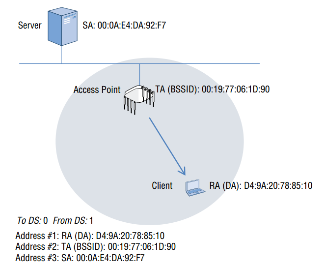
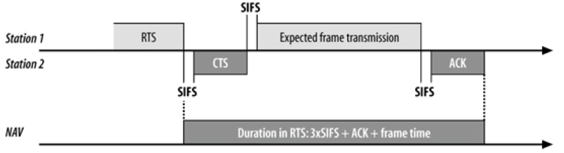

# Introduction to Wi-Fi Header and Information Elements

 ## 1. MAC Layer Overview

​		ISO/IEC 7498标准所定义的OSI/RM只将网络划分为7层。如下图所示：

​		但实际上每一层还可划分为多个子层（sub layer). 所有这些子层中，最为人熟知的就是ISO/IEC 8802规范划分为 data link layer而得到LLC（Logic Link Control Sub layer）和MAC（Medium Access Control Sub layer）。如下图所示：

- Logical Link Control:

  该子层实现两个站点之间帧的交换，实现端到端，无差错的帧传播和应答功能及流量控制功能

- Media Access Control：

  该子层的目的是解决局域网中共用信道的使用产生竞争时，如何分配信道的使用权问题。

​		当网络层的数据发送到数据链路层，数据被移交给LLC后即成为所谓的MAC服务数据单元（MSDU). MSDU包含LLC和第3~7层的数据，简单来说，就是包含IP数据包和一些LLC数据的数据净荷部分。

​		在802.11协议帧中，包含三种帧类型会在本文的后续部分介绍，802.11管理帧和控制帧不携带上层信息，只有802.11数据帧携带MSDU，802.11-2007标准规定MSDU的最大值为2304字节。帧主题的最大值等于MSDU的最大值和用于加密开销的总和。在802.11n-2009中引入A-MSDU帧聚合概念，极大的提高WiFi的吞吐性能。

​		如下图所示，LLC将MSDU发送给MAC子层后，需要MSDU增加MAC header信息。被封装后的MSDU称为MAC协议数据单元（MPDU)，它其实就是802.11帧。帧尾是32bit的CRC值，也被成为帧校验序列（FCS).

​		有了上部分的介绍后，可以总结为802.11mac层其实主要干了两件事情，access control and management。如下图所示：

而MPDU或者MMPDU会继续打包作为PSDU传输到phy 层里面，如下图所示：

## 2. 802.11 MAC Header

​		所有的802.11帧都包含携带二层的MAC帧头，二层信息是没有加密的，可以通过协议分析仪查看其内容  ，如下图所示：

​		802.11Mac帧头由9个主要字段构成，其中4个字段用于寻址，另外5个字段为帧控制，持续时间/ID，序列控制，Qos控制以及HT控制字段。

### 2.1 Frame Control

​		如下图所示，MAC header的前两个字节是帧控制字段，由版本协议，类型，子类型，发往DS，来自DS，更多分片，重试，电源管理，更多数据，受保护帧，+HTC等字段构成

#### 2.1.1 Protocol Verison

- only one version of 802.11 MAC has been developed.
- Protocol version is 0.

#### 2.1.2 Type and Subtype fields

​		在上述的过程中，Bit 2和Bit3表示帧的类型，在802.11 spec中定义了4种类型的：管理帧、控制帧、数据帧以及扩展帧，而扩展帧主要用于802.11ad中，实际使用比较少。

| Bit2，3 value | 帧类型 | 作用                                       |
| ------------- | ------ | ------------------------------------------ |
| 00            | 管理帧 | 发现接入点并加入基本服务集                 |
| 01            | 控制帧 | 确认传输成功并保留无线介质                 |
| 10            | 数据帧 | 携带上层MSDU净荷                           |
| 11            | 扩展帧 | 一种新的，灵活的帧格式，目前仅用于802.11ad |

由于type和subtype字段一起定义帧的功能，因此他们可以定义如下表所示：

管理帧及类型：

控制帧及类型：

数据帧及类型

#### 2.1.3 To DS/From Ds Bit

​		如下图所示，DS（Distribution System)分布式系统，其英文定义为“A system used to interconnectaset of basic service sets(BSSs) and integrated local area networks(LANS) to create an  extended service set(ESS)"。一种将基本服务集(bss)和综合局域网(lan)相互连接以创建扩展服务集(ESS)的系统。它是802.11无线网络四种主要的物理组件之一，其他分别指WM(wireless medium)， STA，AP.

​	扩大BSS1的可以表示如下、

IBSS以及BSS定义如下：

有了DS，ibss， bss概念后，它的bit位表示如下：

|             | To DS = 0                                                    | To Ds =1                                                     |
| ----------- | ------------------------------------------------------------ | ------------------------------------------------------------ |
| From DS = 0 | all Management,controland data frames within an IBSS         | Data frames trasmitted from a wireless station in an infrastructures BSS to DS (STA to AP) |
| From DS = 1 | Date frme received for a wireless station in an infrastructure BSS from DS | Date frames on a "wireless bridge"                           |

**To DS = 0 From DS = 0**

**To DS = 1 From DS = 0**

**To DS = 0 From DS = 1**

**To DS = 1 From DS = 1**

​		由于From DS和To DS与后面的mac header4个 802.11MAC地址有紧密联系，如下图所示：

​		根据发往DS和来自DS子字段的值，这4个MAC地址地段的定义域或许有所不同，5种可能的定义如下：

- SA (srouce address)

  原发送端的MAC地址称为源地址。源地址可以是无线终端，也可能位于有线网络。

- DA (Destination Adress)

  作为二层帧的最终目的地的MAC地址，最终目的地可以是无线终端，也可能位于有线网络。

- TA(Transmitter Address)

  发送端802.11无线接口的MAC地址称为发射机地址。

- RA(Receiver Address)

  接收端802.11无线接口的MAC地址称为接收机地址。

- BSSID(Basic Service Set Identifier)

  它是接入点无线接口的MAC地址。

​	在结合From DS和To DS值，对应的MAC地址设置如下：

一般来讲，地址1字段始终用作接收机地址（RA)，但也可能另有定义；地址2地段始终用作发射机地址(TA)，但同样可能另有定义；地址3地段通常提供附件的MAC地址信息，地址4字段仅在无线分布系统中使用。

##### 2.1.3.1 From DS  = 0  To DS =0

​		当两个字段均设置为0，可能存在不同的几种情况。最长江的情况是，这些帧是管理帧或者控制帧。

还有一种情况在IBSS网络中，客户端之间直接传输数据帧

##### 2.1.3.2 From DS  = 1  To DS =0

​		此时表示接入点想客户端发送802.11数据帧，如下图所示：

##### 2.1.3.3 From DS  = 0  To DS =1

​		表示客户端向接入点发送802.11数据帧

##### 2.1.3.4 From DS  = 1  To DS =1

​		仅当着这两个字段均设置为1事，数据帧才会使用四种地址格式，通常是两个BSS之间的数据交换，如下图所示：

#### 2.1.4 More Fragments

​		当此标志位设置为1后，说明后面的管理帧或者数据帧后面还有对应的分片。

#### 2.1.5 Retry

​		当此标志位值为0表示帧为首次传输，或者传输成功，如果设置为1则表示管理帧或者数据帧传输失败，需要重新传输。

#### 2.1.6 Protected Frame Bit

​	如果保护帧设置为1，表示frame body是加密的。

#### 2.1.7 Power management bit

- 1 表示STA在省电状态，一般是设置在帧交换完成后。
- 0表示STA工作状态。
- AP是不允许进入到PS状态

#### 2.1.8 More data bit

​		如果STA在ps mode，要传给STA的frame都会有AP代收，由AP设定此flag来告诉sta，AP还有其他的frame传输给它。

### 2.2 Duration/ID

​		此栏位表示：传输终端的MAC 帧头中包含的持续时间值，用于重置其他监听终端的NAV计时器。它有16个bit位，如下图所示：

​		在802.11网络中，Duration/ID可以用在以下三种场景里

1. Virtual Carries Sense ：主要目的重置其他终端的NAV计时器
2. Legacy Power Management- ：PS轮询帧使用此字段作为关联标识符(AID）
3. Contention-free Period：该字段用于指示点协调函数(PCF)过程已经开始。

它是bit设置如下

#### 2.2.1 Virtual Carries Sense

​		虚拟载波监听最重要的一个机制就是使用NAV（网络分配矢量），监听终端在侦听到其他终端的帧的传输是将查看帧头，并确定持续时间字段是否包含持续时间值或ID值。如果字段中包含持续时间值，监听终端就将自己的NAV设置为该值，然后使用NAV作为倒数计时器。在倒计时减少到0之前，终端认为射频介质处于繁忙状态。

​		如下图所示，抓取一个单波包和ACK，可以看出传输数据duration 的值为44 μS（此段时间包含ACK+SIFS)，ACK的duration的值设置为0μS。

当传输终端的duration的值为44us，其他的终端也会重设她的NAV值，如下图所示：

如果收到相同的STA MAC地址，NAV是不会去做更新的。

#### 2.2.2 ps-poll in Leagcy Power Management

​		此部分涉及到802.11 电源管理部分，后续在单独说明。

另外PCF由于涉及比较少，因此本章也忽略此部分。

### 2.3  Sequence Control

​		序列控制字段有两个字段构成（Fragment Number）和（Sequence Number)，在进行802.11MSDU分片时使用，分片机制将802.11帧分割为较小的分片，并未每个分片添加头部信息，然后单独传输每个分片。分片的阈值是可以设定的，如果分片阈值设置为300字节，则超过300字节的任何MSDU都会进行分片。

- Sequence Number

  每一个MSDU都有一个顺序号码，其值由0开始，到4095，然后重复轮流使用，有同一个MSDU切割出来的片段都应该使用相同的顺序号码。

- Fragment Number

  指该片段原来MSDU所切割出来的片段顺序

​	如下图所示：序列号为542的MSDU长度为1200字节，当阈值为300字节是，由于分片沿OSI模型向下传输，因此分片操作将自底而上进行，接收端802.11无线接口同样需要使用序列控制字段的信息来重组分片。

由于所有分片都有各自的头部信息，发送每个分片后还将传输SIFS和ACK，因此会降低传输性能，后续802.11n和ac提出帧聚合和块确认，因此不再需要此种机制。

### 2.4 Qos Control Field

​		Qos控制字段的长度为16bit，用于标识数据帧的服务质量（Qos）参数。请注意，并非所有数据帧都包含Qos控制字段，仅有Qos数据帧的MAC帧头使用该字段。它的定义如下表所示：

| Bit  | 定义                                                      |
| ---- | --------------------------------------------------------- |
| 0~3  | Traffic Identifier(TID)                                   |
| 4    | End of Service Period(EOSP)                               |
| 5~6  | ACK Policy                                                |
| 7    | Reserved                                                  |
| 8~15 | TXOP Limit, TXOP duration, AP PS buffer state, Queue Size |

由于这部分涉及到802.1d内容，因此简略介绍，它的sniffer如下：

### 2.4 HT Control Field

​	HT控制字段用于802.11n/ac发射机和接收机的链路自适应，发射波束成形等高级功能。当帧控制字段的+HTC/顺序子字段设置为1是，HT控制字段仅用于管理帧和Qos数据帧。

## 3. 802.11 Frame Types

​		802.11标准定义了3中主要帧的类型，它们是管理帧、控制帧与数据帧。

管理帧又称MAC管理协议数据单元（MMPDU)，由MAC帧头，帧体和帧尾，但不携带任何上层信息。

控制帧用于清除信道，获取信道并提供单播帧确认。控制帧仅由帧头和帧尾构成，没有帧体。

数据帧用来传输上层携带的数据，可进行加密。

他们的示意图如下所示：

### 3.1 Data Frame

​		大多数802.11数据帧携带上层协议传递而来的实际数据。出于数据保密性考虑，第三层到7层信息（MSDU)通常会加密。在802.11中最常见的两种数据帧是数据子类型和Qos数据子类型。

​		一般情况下只需要关注4种数据帧子类型data frame， null frame， Qos data， Qos null data。

Null Frame：

- When a Sta sleeps， AP must begin buffering frames for the STA. if the STA has no data to send through the distribution syste， it use a null frame with the power management bit set.
- Consist of A Mac header followed by the FCS
- APs never enter power-saving mode and do not send Null frame

### 3.2 Control Frame

​		Control Frame常见的帧类型如下：

下面将以RTS/CTS 以及ACK为例介绍控制帧相关内容。

#### 3.2.1 RTS/CTS

RTS的帧格式如下图所示：

- Duration（unit:us)

  3 SIFS + 1 CTS + 1 Ack + 1 Frame

  

- RA

  the address of the STA that is the intended recipient of the pending frame.

- TA

  the address of the STA transmitting the RTS frame.

CTS的帧格式如下图所示：

- Duration（unit：us）

  RTS Duration - 1 SIFS - 1 CTS

  

他们的sniffer抓包显示如下：

#### 3.2.2 ACK

​		由于802.11通信使用的无线介质无法确保数据传输成功，发送端只能依靠接收端的通知来判断传输的帧是否已正确接收。它的帧格式如下：

- Duration
  - More Fragments bit = 0 (non-fragment/final fragment)
  - More Fragments bit = 1 ---> Fragment duration - 1 Ack - 1 SIFS(Virtual CTS)

- RA

  Copied from the transmitter of the frame being acknod

它的sniffer抓取显示如下：

### 3.3 Management Frame

